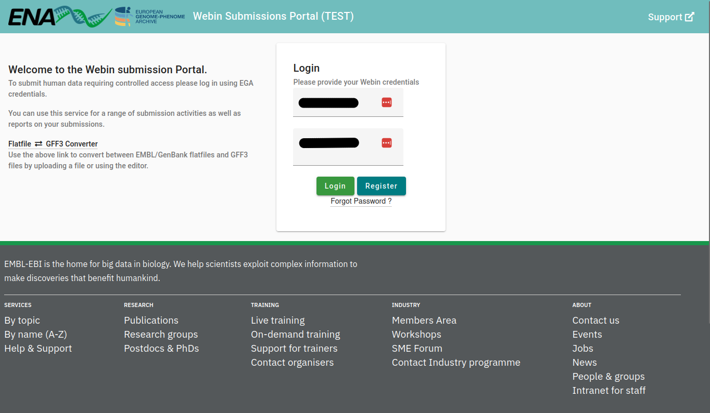
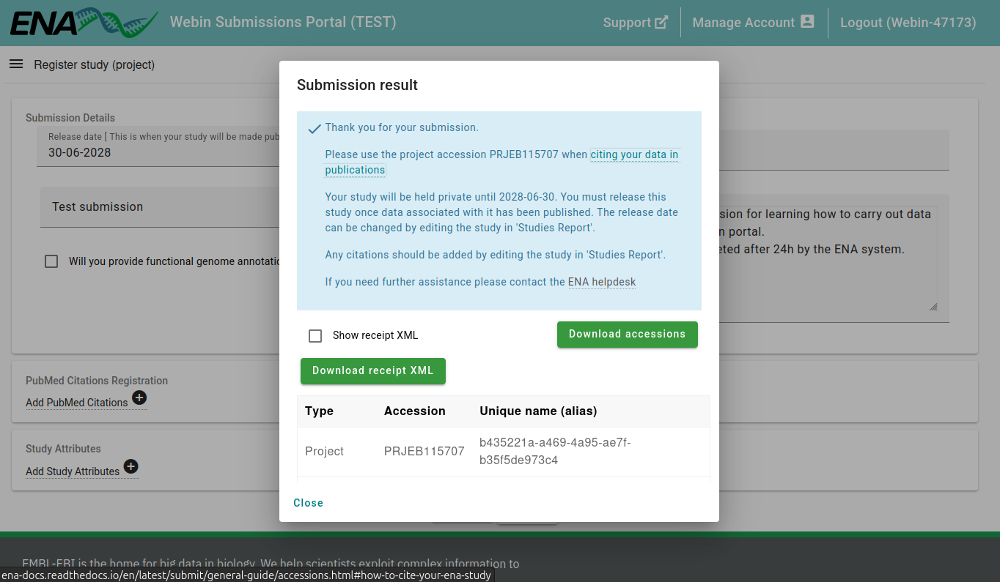
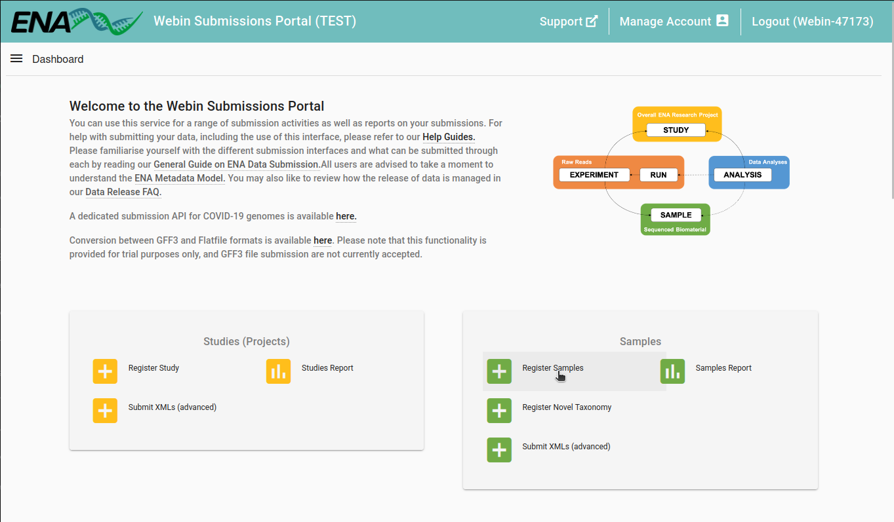
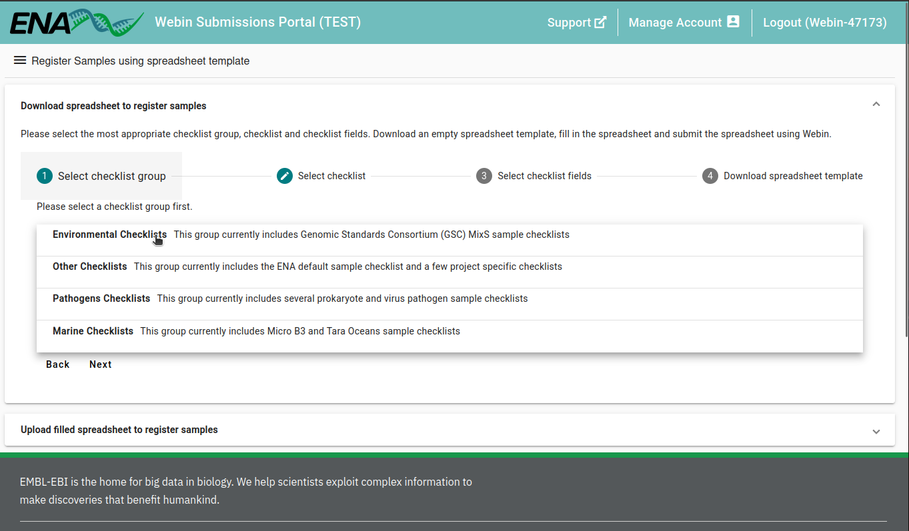
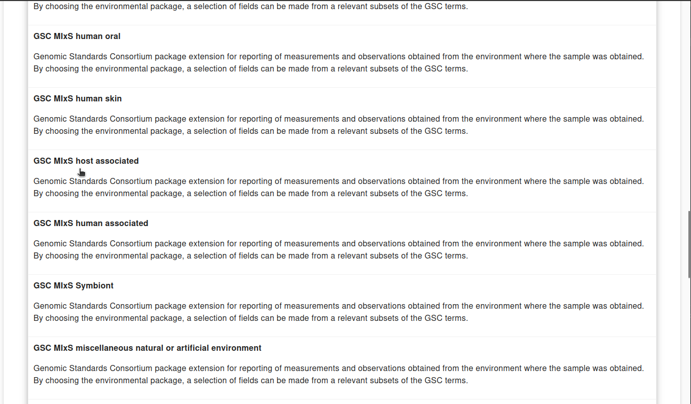
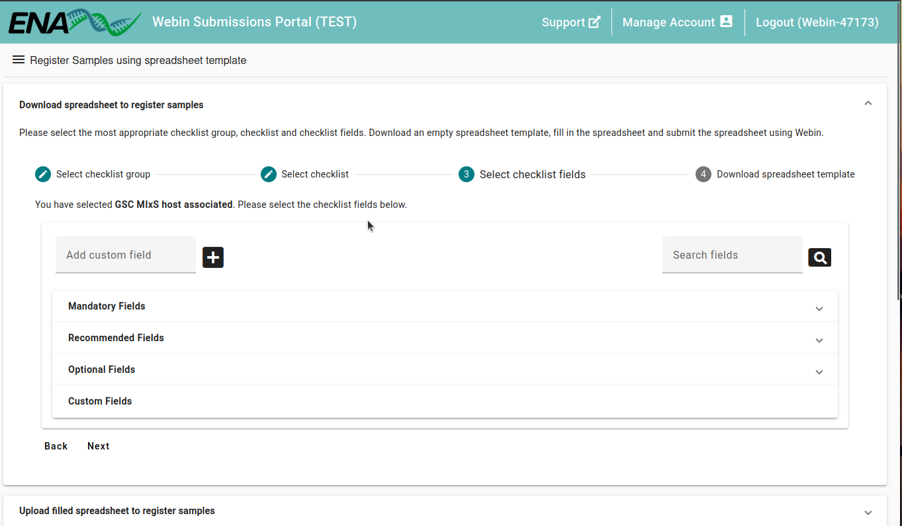
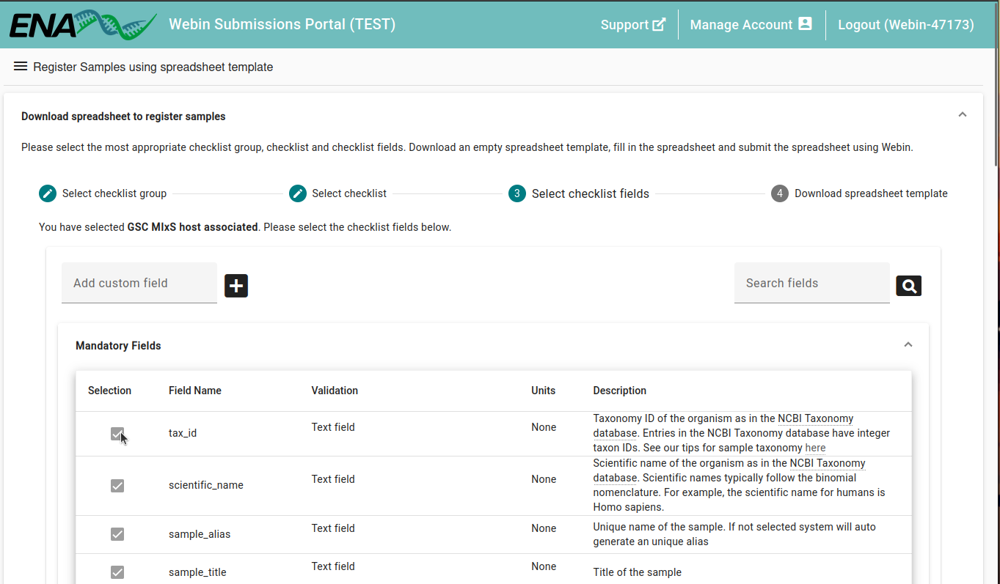

::: {.callout-note collapse="true" title="Self guided: chapter environment setup"}
For this chapter's exercises, if not already performed, you will need to download the chapter's dataset, decompress the archive, and create and activate the Conda environment.

Do this, use `wget` or right-click and save to download this Zenodo archive: [TODO](TODO), and unpack

```bash
tar xvf metadata-and-submitting-to-ena.tar.gz 
cd metadata-and-submitting-to-ena/
```

You can then create the subsequently activate environment with

```bash
conda env create -f metadata-and-submitting-to-ena.yml
conda activate metadata-and-submitting-to-ena
```
:::

## Introduction

### Is ancient metagenomic data FAIR?

The field of ancient DNA has long been a poster child for open data sharing [@Anagnostou2015-mz,@Lien-Talks2024-ia], due to most sequencing data being made publicly available without restrictions for use by other researchers.
However in more recent years, the field has been taking a closer introspective look at the quality of such data uploads.

While the vast majority of data is being made accessible with interoperable formats, the 'findability' and 'reusability' of such data is often limited by the lower quality of the accompanying metadata [@Bergstrom2024-ct,@Bergstrom2024-ka].
Furthermore, many ancient DNA sequencing data files have been inconsistently uploaded without following the guidelines from the repositories themselves [@Fellows_Yates2021-rp].
Much of the contextual information around the data is heterogenously buried in manuscripts themselves, or in supplementary materials in non machine-readable formats, let alone being stored in a searchable manner.

The result of this is that ancient DNA is not 'Findable, Accessible, Interoperable, Reusable' (FAIR) principles compliant [@Wilkinson2016-ou], and thus reducing the full potential for new discoveries from such unique and rare data.
There have been attempts to improve the quality of ancient DNA data through _post hoc_ initiatives such as AncientMetagenomeDir [@Fellows_Yates2021-rp] for ancient metagenomic data, the AADR [@Mallick2024-zz] or Poseidon [@Schmid2024-mo] for human population genomics, or metAaRCive ([https://doi.org/10.5281/zenodo.20085066](https://doi.org/10.5281/zenodo.20085066)) for ancient animal genomics.
However, these projects involve significant efforts to 'curate' and 'clean up' metadata.
Ideally, high-quality metadata should be situated with the data itself, not on external volunteer run databases.

### Metadata standards and the ENA

The [MInAS metadata standard](https://www.mixs-minas.org/) aims to provide a metadata schema that extends and integrates critical metadata for ancient DNA into the existing generalised MIxS metadata standard [@Yilmaz2011-ci].
The MIxS checklists have been adopted by the INSDC collection of repositories, including the European Nucleotide Archive (ENA), the USA's Sequencing Read Archive (SRA), and Japan's DNA Databank of Japan.
Thus, having the ancient metagenomics community use the well-established MIxS checklists, in combination with the required information the ancient DNA field needs, will increase the findability and reusability of ancient metagenomic data in public databases.

### Objectives

This chapter will cover the basics of how to annotate your sample and metagenomic sequencing data with the MInAS MIxS metadata standard, and how to submit your data to the European Nucleotide Archive (ENA).

This chapter is split into three sections:

1. Preparing raw sequencing reads for submission to INSDC 
2. Annotating your samples and raw sequencing reads with metadata, with specific guidance for ancient metagenomic and ancient pathogen data. 
3. Validating and submitting your data to the ENA

Each section will provide example commands, utilising the ENA test data server for validation and submission allowing you to familiarise yourself with the process without needing to submit your own data.

By the end of the chapter, you will be able to prepare and submit your own ancient metagenomic and ancient pathogen sequencing data to the ENA, following best practice 'FAIR' principles [@Wilkinson2016-ou] for maximising reproducibility and re-use of your data by other researchers.

::: {.callout-warning title="Scope of chapter"}
This chapter only covers the preparation and submission of raw reads of (predominantly microbial) ancient metagenomes and ancient pathogen sequencing data to the ENA from human, animal, plant, and soil/sediment samples.

It does not cover the preparation of assemblies or genomes as these require different data, quality metadata, and steps.
:::

::: {.callout-note title="ENA vs SRA vs DDBJ"}
For simplicity we focus just on the ENA for this chapter, as the ENA is the most commonly used repository for ancient metagenomic data.
However much of the concept will apply to the other INSDC repositories, which while may vary slightly in their submission process, they all aim to follow the same data sharing principles.
:::

## Set up

This chapter will be simulating the preparation and submission of raw sequencing reads to the ENA, using the ENA test server for validation and submission.

We will be using read clipping tools to get the sequencing data in the requested format by the ENA, and then preparing the metadata spreadsheets.

In addition to the data and software included in the `metadata-and-submitting-to-ena.yml` Conda environment, we will also need:

1. A web browser
2. A free ENA Webin account, which can be created at [https://www.ebi.ac.uk/ena/submit/webin/login](https://www.ebi.ac.uk/ena/submit/webin/login).

::: {.callout-tip title="ENA Webin account"}
A single-user ENA Webin account is not the normal procedure for submitting the data.
Typically it is expected a [single institute or laboratory](https://ena-docs.readthedocs.io/en/latest/submit/general-guide/registration.html) will have a shared single ENA Webin account for multiple users, representing the 'sequencing' or 'submitting' centre.

However for the chapter we will use a single-user account for for training purposes.
:::

In this tutorial we will be simulating a data submission by reusing a small subset of an ancient dental calculus metagenomic dataset [@Fellows_Yates2021-rf], originally uploaded to [PRJEB34569](https://www.ebi.ac.uk/ena/browser/view/PRJEB34569).

This dataset contains a large range of different types of sequencing data, including single-end and paired-end reads, different sequencing machine models, and different library preparation methods.
This variety will allow us to demonstrate the different types of data that can be submitted and annotated to the ENA.

The small subset of the data used in this tutorial includes variation in species, library preparation methods, and sequencing machine models, as well as including a couple of controls.

| study_accession | secondary_sample_accession | sample_alias | scientific_name                | library_name        | Treatment | instrument_model    | library_layout | run_accession |
|-----------------|----------------------------|--------------|--------------------------------|---------------------|-----------|---------------------|----------------|---------------|
| PRJEB34569      | ERS3774455                 | TAF017.E     | Homo sapiens                   | TAF017.E0101        | nUDG      | NextSeq 500         | PAIRED         | ERR3579816    |
| PRJEB34569      | ERS3774455                 | TAF017.E     | Homo sapiens                   | TAF017.E0101.171215 | nUDG      | NextSeq 500         | PAIRED         | ERR3579815    |
| PRJEB34569      | ERS3774465                 | MOA001.A     | Homo sapiens                   | MOA001.A0101        | nUDG      | NextSeq 500         | SINGLE         | ERR3579677    |
| PRJEB34569      | ERS3774419                 | KNP001.A     | Pan troglodytes schweinfurthii | KNP001.A0101        | fUDG      | Illumina HiSeq 4000 | PAIRED         | ERR3579760    |
| PRJEB34569      | ERS4260688                 | EXB033.A0401 | blank sample                   | EXB033.A0401        | fUDG      | Illumina HiSeq 4000 | PAIRED         | ERR3839747    |
| PRJEB34569      | ERS4260707                 | LIB025.A1001 | blank sample                   | LIB025.A1001        | fUDG      | NextSeq 500         | PAIRED         | ERR3839766    |

The study accession and secondary sample accessions refer to the data currently available on the ENA.
However the dataset used in this tutorial are the _submitted_ data, with the original read heads and file names.
Note that the two TAF017.E samples are two sequencing runs of the same library, thus share the same sample accession.

::: {.callout-note title="Ancient pathogen data"}
Note that even though we will be focusing on a shotgun-sequenced ancient microbiome dataset, much of the content of this chapter will also apply to most aDNA data.

We will have specific call-out boxes for guidance on aspects specific to ancient pathogen, so keep an eye out for these! 
:::

## Preparing raw sequencing reads 

### Background

The ENA describes the requirements for raw sequencing reads in their [submission guidelines](https://ena-docs.readthedocs.io/en/latest/submit/fileprep/reads.html).

The relevant formats for most ancient DNA sequencing data are:

- BAM
- FASTQ

In particular, the ENA recommends uploading reads in the 'unmapped BAM' format.
Despite the widespread use of the FASTQ files, the BAM format has an actual format specification, and thus a well-defined validation process to ensure that uploaded reads are in the correct format.
Furthermore, BAM files are a highly compressible binary format for storing sequencing reads, making upload and storage more efficient.

[Unmapped BAM](https://gatk.broadinstitute.org/hc/en-us/articles/360035532132-uBAM-Unmapped-BAM-Format) files are a variant form of a BAM file that does not contain mapping or alignment information (the primary purpose of the BAM family of files).
These are therefore ideal for any type of raw sequencing reads of ancient DNA sample as any ancient DNA sample is _intrinsically_ metagenomic - and does not contain DNA from just a single organism.

It is important to note that regardless of the format you upload, the ENA will always convert back to FASTQ - as the rawest format for sequencing reads.
This is particularly important, as outside of traditional single-species genomics, SAM/BAM/CRAM formats are currently not as widely accepted by bioinformatics tools - such as in taxonomic profiling or metagenomic _de novo_ assembly.

To prepare our reads, we will:

1. Prepare our FASTQ files to follow the ENA requirements using various adapter trimming tools
2. Convert to unmapped BAM format using `samtools`.

### Read preparation overview

The ENA provides clear [specifications](https://ena-docs.readthedocs.io/en/latest/submit/fileprep/reads.html#fastq-format) in which state reads must be before submission.

Most of these are implicit to the FASTQ format as we learnt in the [Introduction to NGS Sequencing](./introduction-to-ngs-sequencing) chapter (e.g., multiples of 4 lines, sequence, read IDs starting with `@`, spacer lines with `+`).

Despite this, some of these implicit (or explicit!) requirements have however not always been followed in the past by ancient DNA researchers.
These common mistakes have been previously reported [@Fellows_Yates2021-rp], and are described here:

- Index, adapter, and barcodes MUST BE removed from the reads
- Paired-end reads MUST NOT be merged
- Multiple libraries from the same sample MUST NOT be merged into a single FASTQ file
- Multiple samples from the same individual MUST NOT be merged into a single FASTQ file

:::{.callout-note title="Why not uploaded partly processed reads" collapse="true"}
Some researchers have argued that they previously uploaded partly processed reads as they represent a more realistic state from which their own analysis was based upon. 
However, as researchers aiming to make our data FAIR, we should aim to upload the rawest form of our data possible.
Instead, reproducibility should be achieved by good documentation and descriptions of how every bit of processing and/or analysis was carried out.

Partly processing data can restricts future researchers from making novel advances.
For example, uploading merging paired-end reads affects researchers today, as it prevents the use of metagenomic _de novo_ assembly tools that require paired-end reads.
It also affects future researchers, who would not be able to use an improved read-merging tool with a better algorithm than the one used by the original researchers. 
:::

In this vein, we will now provide example commands of two commonly used tools for adapter and index removal within ancient DNA, `fastp` and `AdapterRemoval`, to prepare our reads for simulated submission to the ENA.
Follow the section for the tool of your choice.

### Read preparation with fastp

If your read clipping tool of choice is `fastp`, we would run the following command to make our single end data compliant for the ENA:

```bash
fastp \
    -i ERR3579677/MOA001.A0101_S0_L000_R1_000.fastq.gz \
    -o ERR3579677/MOA001.A0101_S0_L000_R1_000_trimmed.fastq.gz \
    -j ERR3579677/MOA001.A0101_S0_L000_R1_000_trimmed_log.json \
    -Q \
    -l 1 \
    --disable_trim_poly_g
```

Let's break this command down:

1. We define the input, output, and log files with `-i`, `-o`, and `-j`, respectively
2. We deactivate quality filtering with `-Q` (ENA does not require any quality trimming or filtering)
3. We specify the minimum read length with `-l 1` (leaving a single base prevents empty reads/lines from adapter only sequence, to ensure we don't violate the multiple of 4 rule)
4. We disable poly-G trimming with `--disable_trim_poly_g` (ENA does not require any quality trimming or filtering)

Note that we have not specified any adapter sequences to remove, as `fastp` will automatically detect and remove adapters from the reads.
If we want to specify our own adapter sequences, we can use the `--adapter_sequence` and `--adapter_sequence_r2` options.

The resulting `ERR3579677/MOA001.A0101_S0_L000_R1_000_trimmed.fastq.gz` is the file will submit to the ENA.

:::{.callout-note}
You will get a message from `fastp` saying 'No adapter detected for read1'.
This is to be expected.
The demo data we are using here is re-downloaded public data passing ENA validation, thus no adapters or barcodes are present on the reads.
:::

Our resulting single-end FASTQ files will be barcode and adapter free, without any other filtering to allow future researchers to improve on data processing while still being ENA compliant.

To make paired-end data compliant for the ENA, we would run the following command:

```bash
fastp \
    -i ERR3579815/TAF017.E0101.171215_S0_L000_R1_000.fastq.gz \
    -I ERR3579815/TAF017.E0101.171215_S0_L000_R2_000.fastq.gz \
    -o ERR3579815/TAF017.E0101.171215_S0_L000_R1_000_trimmed.fastq.gz \
    -O ERR3579815/TAF017.E0101.171215_S0_L000_R2_000_trimmed.fastq.gz \
    -j ERR3579815/TAF017.E0101.171215_S0_L000_R2_000_trimmed_log.json \
    -Q \
    -l 1 \
    --disable_trim_poly_g
```

The command is the same as for single-end data, except we add the second read's FASTQ with `-I` and `-O` for input and output respectively.

The resulting `ERR3579677/TAF017.E0101.171215_S0_L000_R1_000_trimmed.fastq.gz` and `ERR3579677/TAF017.E0101.171215_S0_L000_R2_000_trimmed.fastq.gz` are the read 1 and read 2 files we will submit to the ENA.


:::{.callout-note}
In this case you will see a message from `fastp` saying 'reads with adapter trimmed <number>'.
This is also to be expected!
While the demo data we are using here is re-downloaded public data passing ENA validation, this demonstrates how adapter clipping tools may not always work perfectly.
In the future, updated bioinformatics tools may provide better accuracy so we should as a general rule leave the rawest form of our data for future researchers to reprocess.

Note however we still make a best effort to remove adapters and barcodes specifically (rather than leaving them for future researchers), as this is requested by the ENA guidelines.
:::

We can now run the same command for the remaining files in our example dataset.

```bash
fastp -i ERR3579760/KNP001.A0101_S0_L000_R1_000.fastq.gz -I ERR3579760/KNP001.A0101_S0_L000_R2_000.fastq.gz -o ERR3579760/KNP001.A0101_S0_L000_R1_000_trimmed.fastq.gz -O ERR3579760/KNP001.A0101_S0_L000_R2_000_trimmed.fastq.gz -j ERR3579760/KNP001.A0101_S0_L000_000_trimmed_log.json -Q -l 1 --disable_trim_poly_g
fastp -i ERR3579816/TAF017.E0101_S0_L000_R1_000.fastq.gz -I ERR3579816/TAF017.E0101_S0_L000_R2_000.fastq.gz -o ERR3579816/TAF017.E0101_S0_L000_R1_000_trimmed.fastq.gz -O ERR3579816/TAF017.E0101_S0_L000_R2_000_trimmed.fastq.gz -j ERR3579816/TAF017.E0101_S0_L000_000_trimmed_log.json -Q -l 1 --disable_trim_poly_g
fastp -i ERR3839747/EXB033.A0401_S0_L000_R1_000.fastq.gz -I ERR3839747/EXB033.A0401_S0_L000_R2_000.fastq.gz -o ERR3839747/EXB033.A0401_S0_L000_R1_000_trimmed.fastq.gz -O ERR3839747/EXB033.A0401_S0_L000_R2_000_trimmed.fastq.gz -j ERR3839747/EXB033.A0401_S0_L000_000_trimmed_log.json -Q -l 1 --disable_trim_poly_g
fastp -i ERR3839766/LIB025.A1001_S0_L000_R1_000.fastq.gz -I ERR3839766/LIB025.A1001_S0_L000_R2_000.fastq.gz -o ERR3839766/LIB025.A1001_S0_L000_R1_000_trimmed.fastq.gz -O ERR3839766/LIB025.A1001_S0_L000_R2_000_trimmed.fastq.gz -j ERR3839766/LIB025.A1001_S0_L000_000_trimmed_log.json -Q -l 1 --disable_trim_poly_g
```

### Read preparation with AdapterRemoval

If your read clipping tool of choice is `AdapterRemoval` (v2), we would run the following command to make our single end data compliant for the ENA:

```bash
AdapterRemoval \
    --file1 ERR3579677/MOA001.A0101_S0_L000_R1_000.fastq.gz \
    --basename ERR3579677/MOA001.A0101_S0_L000_R1_000_trimmed \
    --gzip \
    --minlength 1
```

Let's break this command down:

1. We define the input file with `--file1` and output name with `--basename`
2. We specify to gzip the output with `--gzip` (as required by the ENA)
3. We set the minimum length to 1 (leaving a single base prevents empty reads/lines from adapter only sequence, to ensure we don't violate the multiple of 4 rule)

Note that we have not specified any adapter sequences to remove, as `AdapterRemoval` has it's own [defaults sequences](https://adapterremoval.readthedocs.io/en/2.3.x/manpage.html#fastq-trimming-options) for common Illumina adapters.
We can also define your own adapters with `--adapter1`, `--adapter2`, or `--adapter-list`.
Note that the `--identify-adapters` only reports possible sequences, it does not remove them like `fastp`!

:::{.callout-note}
If you inspect the `*settings` file you may see a number of reads still with adapters, even though this is re-downloaded public data already passing the ENA validation.
This demonstrates how adapter clipping tools may not always work perfectly.
In the future, updated bioinformatics tools may provide better accuracy so we should as a general rule leave the rawest form of our data for future researchers to reprocess.

Note however we still make a best effort to remove adapters and barcodes specifically (rather than leaving them for future researchers), as this is requested by the ENA guidelines.
:::

You will then have three output files: 

- ERR3579677/MOA001.A0101_S0_L000_R1_000_trimmed.discarded.gz: in this case, empty as no quality or length filtering was performed 
- ERR3579677/MOA001.A0101_S0_L000_R1_000_trimmed.settings: reports and statistics of the trimming process
- ERR3579677/MOA001.A0101_S0_L000_R1_000_trimmed.truncated.gz: the trimmed reads (the one we will upload!)

To make paired-end data compliant for the ENA, we would run the following command:

```bash
AdapterRemoval \
    --file1 ERR3579815/TAF017.E0101.171215_S0_L000_R1_000.fastq.gz \
    --file2 ERR3579815/TAF017.E0101.171215_S0_L000_R2_000.fastq.gz \
    --basename ERR3579815/TAF017.E0101.171215_S0_L000_trimmed \
    --gzip \
    --minlength 1
```

The command is essentially the same as for single-end data, except we add the second read's FASTQ with `--file2`.

:::{.callout-note}
If you inspect the `*settings` file you may see a number of reads still with adapters, even though this is re-downloaded public data already passing the ENA validation.
This demonstrates how adapter clipping tools may not always work perfectly.
In the future, updated bioinformatics tools may provide better accuracy so we should as a general rule leave the rawest form of our data for future researchers to reprocess.

Note however we still make a best effort to remove adapters and barcodes specifically (rather than leaving them for future researchers), as this is requested by the ENA guidelines.
:::

This time we have more output files:

- ERR3579815/TAF017.E0101.171215_S0_L000_trimmed.discarded.gz: in this case, empty as no quality or length filtering was performed 
- ERR3579815/TAF017.E0101.171215_S0_L000_trimmed.pair1.truncated.gz: the trimmed R1 reads (the one we will upload!)
- ERR3579815/TAF017.E0101.171215_S0_L000_trimmed.pair2.truncated.gz: the trimmed R2 reads (the one we will upload!)
- ERR3579815/TAF017.E0101.171215_S0_L000_trimmed.settings: reports and statistics of the trimming process
- ERR3579815/TAF017.E0101.171215_S0_L000_trimmed.singleton.truncated.gz: left-over reads where one read in pair was discarded. In this case, empty as no quality or length filtering was performed.

We can now run the same command for the remaining files in our example dataset.

```bash
AdapterRemoval --file1 ERR3579760/KNP001.A0101_S0_L000_R1_000.fastq.gz --file2 ERR3579760/KNP001.A0101_S0_L000_R2_000.fastq.gz --basename ERR3579760/KNP001.A0101_S0_L000_000_trimmed --gzip --minlength 1
AdapterRemoval --file1 ERR3579816/TAF017.E0101_S0_L000_R1_000.fastq.gz --file2 ERR3579816/TAF017.E0101_S0_L000_R2_000.fastq.gz --basename ERR3579816/TAF017.E0101_S0_L000_000_trimmed --gzip --minlength 1
AdapterRemoval --file1 ERR3839747/EXB033.A0401_S0_L000_R1_000.fastq.gz --file2 ERR3839747/EXB033.A0401_S0_L000_R2_000.fastq.gz --basename ERR3839747/EXB033.A0401_S0_L000_000_trimmed --gzip --minlength 1
AdapterRemoval --file1 ERR3839766/LIB025.A1001_S0_L000_R1_000.fastq.gz --file2 ERR3839766/LIB025.A1001_S0_L000_R2_000.fastq.gz --basename ERR3839766/LIB025.A1001_S0_L000_000_trimmed --gzip --minlength 1
```

### Read preparation with other tools

If you have a different read clipping tool of choice, we can use that instead.
The important thing is that the resulting reads are in a state that is compliant with the ENA requirements, as described above.
Most read processing tools will support similar parameters for both `fastp` and `AdapterRemoval`, so we should be able to adapt the commands above to your tool of choice.

Remember: the most important thing is to do as little processing as possible (no read merging, quality filtering/trimming, etc.) to ensure the rawest form of your data is uploaded to the ENA.
Just remove adapters, barcodes, or other synthetic technical sequences - and we should be ready!

### Format conversion

Now that our reads are in the correct state, we can convert them to unmapped BAM format using `samtools`.

We can use the `samtools import` command as follows.

For single end data run:

```bash
## DO NOT RUN
samtools import -s <samplename>.fastq.gz -O BAM -o <samplename>.bam
```

For paired-end data run:

```bash
## DO NOT RUN
samtools import -1 <samplename>.fastq.gz -2 <samplename>.fastq.gz -O BAM -o <samplename>.bam
```

Thus for our example dataset, we can run the following for the single-end sample to generate unmapped BAM format:

```bash
samtools import -s ERR3579677/MOA001.A0101_S0_L000_R1_000_trimmed.fastq.gz -O BAM -o ERR3579677/MOA001.A0101_S0_L000_R1_000_trimmed.bam
```

:::{.callout-warning}
Make sure to update the FASTQ file names in the commands if you used different read clipping tools!
The examples here are from using `fastp`, but if you used `AdapterRemoval` or another tool, the FASTQ file names may be different.
:::

If you want to validate the resulting BAM file, we can first generate some statistics on the FASTQ file with `seqkit stats`: 

```bash
seqkit stats ERR3579677/MOA001.A0101_S0_L000_R1_000_trimmed.fastq.gz
```
```bash
file                                                     format  type   num_seqs     sum_len  min_len  avg_len  max_len
ERR3579677/MOA001.A0101_S0_L000_R1_000_trimmed.fastq.gz  FASTQ   DNA   1,240,487  74,677,661        1     60.2       76
```

Then compare the numbers in the resulting BAM file with `samtools flagstat`:

```bash
samtools flagstat ERR3579677/MOA001.A0101_S0_L000_R1_000_trimmed.bam | head -n 7
```
```bash
1240487 + 0 in total (QC-passed reads + QC-failed reads)
1240487 + 0 primary
0 + 0 secondary
0 + 0 supplementary
0 + 0 duplicates
0 + 0 primary duplicates
0 + 0 mapped (0.00% : N/A)
```

Furthermore, If we inspect the contents of the resulting BAM file with samtools, we see we retain all the information needed to generate a FASTQ file, namely the read ID, the DNA sequence itself and the quality scores.

```bash
samtools view ERR3579677/MOA001.A0101_S0_L000_R1_000_trimmed.bam | head -n 4
```
```
NS500382:52:HGVMGBGXY:1:11101:19213:1069	4	*	0	0	*	*	0	0	CAGAATTGTATACTCGTCACCGGGCTTCATGTCCGGTGCGACGTACTCATGTACGTCCAAAGCCTGACGATATTT	AAAAAEEEEEEEEEEAEEEEEEAEEEEEEEEEAEEEEEEE/EEEEEEEEEEEAEEE<AEE6EEEEEEEEEEEEEE
NS500382:52:HGVMGBGXY:1:11101:16668:1078	4	*	0	0	*	*	0	0	TTTGGAAAAATACGGATGGAAAGATCGAAGTCTTTCACCGTTATATGATTCCGGGACGGTCAACGCCGTATAATAT	AAA6AEEEEE/AAEE/E/EEEAEEEEA<E/EAEE/E/EA<AA/EE//EAE6/E//EA//E/6E6//EEEEE/E<AE
NS500382:52:HGVMGBGXY:1:11101:20127:1100	4	*	0	0	*	*	0	0	GTTAAACAGAAGGCTGCAGCTTATTAAAATAAT	AAAAAEEEE/EEEEEEEEEEAEEEEEEEEEEEE
NS500382:52:HGVMGBGXY:1:11101:10521:1116	4	*	0	0	*	*	0	0	GATAACATTCGTCTTTCCAAGGCGGTGAAGAAGCAGGTTGCAGATGATGAGACGGAACTTGA	AAAAAEEEEEEEEEEEEEEEEEA<AEEEEEAEEEEEEEEEEEEEE6EEEE/EEEEEEEEAEE
```

The same goes for paired-end data, where we can run the following to generate unmapped BAM format:

```bash
samtools import -1 ERR3579815/TAF017.E0101.171215_S0_L000_R1_000_trimmed.fastq.gz -2 ERR3579815/TAF017.E0101.171215_S0_L000_R2_000_trimmed.fastq.gz -O BAM -o ERR3579815/TAF017.E0101.171215_S0_L000_000_trimmed.bam
```

Generate some statistics on the FASTQ file with `seqkit stats`: 

```bash
seqkit stats ERR3579815/TAF017.E0101.171215_S0_L000_R1_000_trimmed.fastq.gz
seqkit stats ERR3579815/TAF017.E0101.171215_S0_L000_R2_000_trimmed.fastq.gz
```
```bash
file                                                            format  type  num_seqs    sum_len  min_len  avg_len  max_len
ERR3579815/TAF017.E0101.171215_S0_L000_R1_000_trimmed.fastq.gz  FASTQ   DNA     32,412  2,005,141        1     61.9       76
file                                                            format  type  num_seqs    sum_len  min_len  avg_len  max_len
ERR3579815/TAF017.E0101.171215_S0_L000_R2_000_trimmed.fastq.gz  FASTQ   DNA     32,412  1,998,083        1     61.6       76

```

Then compare the numbers in the resulting BAM file with `samtools flagstat`:

```bash
samtools flagstat ERR3579815/TAF017.E0101.171215_S0_L000_000_trimmed.bam | head -n 7
```
```bash
64824 + 0 in total (QC-passed reads + QC-failed reads)
64824 + 0 primary
0 + 0 secondary
0 + 0 supplementary
0 + 0 duplicates
0 + 0 primary duplicates
0 + 0 mapped (0.00% : N/A)
```

With the sum of the reads in two FASTQ files matching the total number of reads in the resulting BAM file.

And finally if we look inside the BAM file, we see each read pair are grouped together.

```bash
samtools view ERR3579815/TAF017.E0101.171215_S0_L000_000_trimmed.bam | head -n 4
```
```
NS500382:60:HKGL5BGX3:1:11101:15454:2507	77	*	0	0	*	*	0	0	GGACCTGCTTGAGGCGACCGCGCTCGGAGGGGTGGACGACGACAT	AAAAAEEEEEEEEEEEEEEEEEEEAEEEEEEEEEEEEEEEEEEEE
NS500382:60:HKGL5BGX3:1:11101:15454:2507	141	*	0	0	*	*	0	0	ATGTCGTCGTCCACCCCTCCGAGCGCGGTCGCCTCAAGCAGGTC	AAAAAEEEEEE/A<EEEEEAEEAAEEEEEEEEEEEE6AEEEEEE
NS500382:60:HKGL5BGX3:1:11101:9496:2915	77	*	0	0	*	*	0	0	GGATCACGATCGGGCGTTCCAGGACCGGCGGCTTTAAGGGCT	AAAAAEEEEEEEEEEEEEEEEEEEEEEEEEEEEEEEEEEEEE
NS500382:60:HKGL5BGX3:1:11101:9496:2915	141	*	0	0	*	*	0	0	AGCCCTTAAAGCCGCCGGTCCTGGAACGCCCGATCGTGATCC	AAAAAEEEEEEEEEEEEEEEEEEEEEEEEEEEEEEEEEEEEE
```

To generate the rest of our BAM files:

```bash
samtools import -1 ERR3579760/KNP001.A0101_S0_L000_R1_000_trimmed.fastq.gz -2 ERR3579760/KNP001.A0101_S0_L000_R2_000_trimmed.fastq.gz -O BAM -o ERR3579760/KNP001.A0101_S0_L000_000_trimmed.bam
samtools import -1 ERR3579816/TAF017.E0101_S0_L000_R1_000_trimmed.fastq.gz -2 ERR3579816/TAF017.E0101_S0_L000_R2_000_trimmed.fastq.gz -O BAM -o ERR3579816/TAF017.E0101_S0_L000_000_trimmed.bam
samtools import -1 ERR3839747/EXB033.A0401_S0_L000_R1_000_trimmed.fastq.gz -2 ERR3839747/EXB033.A0401_S0_L000_R2_000_trimmed.fastq.gz -O BAM -o ERR3839747/EXB033.A0401_S0_L000_000_trimmed.bam
samtools import -1 ERR3839766/LIB025.A1001_S0_L000_R1_000_trimmed.fastq.gz -2 ERR3839766/LIB025.A1001_S0_L000_R2_000_trimmed.fastq.gz -O BAM -o ERR3839766/LIB025.A1001_S0_L000_000_trimmed.bam
```

## Metadata Annotation of samples and reads

With the reads prepared we can now prepare the metadata for our samples and reads for submission to the ENA.

These steps will require a combination of the ENA Webin submission portal, spreadsheets, and the `ena-webin-cli` command line tool.

### Testing environment

The ENA provides a test environment [https://wwwdev.ebi.ac.uk/ena/submit/webin](https://wwwdev.ebi.ac.uk/ena/submit/webin) for users to familiarise themselves with the submission process without needing to submit their own data.

Everything submitted to this test server will deleted after 24 hours, so this is perfect to get familiar with the system before uploading your data for real. 

:::{.callout-danger}
Verify across all the following sections that you are using the development 'test' environment website for testing!

Do not submit anything to the production website!

- Test URL: https://wwwdev.ebi.ac.uk/ena/submit/webin/
- Production URL: https://www.ebi.ac.uk/ena/submit/webin
:::

First log in to the ENA Webin test environment with your single-person ENA Webin account.

{#fig-metadatasubmittingena-1-webin-testenv-login.png}

Once logged in, we will be in the landing page of the ENA's Webin (test) portal. 

{#fig-metadatasubmittingena-2-webin-testenv-landing.png}

On this page we will find some basic information and then different boxes with buttons corresponding to the major steps of the ENA submission cycle, namely:

1. Registering studies
2. Registering samples
3. Registering raw reads (with experiment and run metadata)
4. Registering data analyses
5. Tools

In this tutorial we will be addressing steps 1 to 3, as we are focusing on the submission of raw sequencing reads, rather than assemblies and genomes (which fall under the 'Data Analyses' step).
We will use the Webin browser interface for registering studies and samples, and the `ena-webin-cli` command line tool for submitting the data itself.

### Project metadata

An ENA study is the highest level of a submission.
This typically (but not strictly!) corresponds to a single scientific publication.
A study represents a collection of samples, experiments, and runs.
Note that runs can be associated with multiple projects, even if the sample was originally submitted with an earlier project!

To create a new study, press the 'Register study' button.
In this page, you will find four sections:

- Release date
  - Set to the date when the data should be made public.
  - Typically date of publication, but possibly earlier if requested by reviewers.
  - Note that you can later adjust this release date (bring forward, or later)
- Study name
  - A short title of the study, only really used for display purposes in the ENA Webin portal itself
- Name of study
  - A long-form title of the study.
  - Typically corresponds to the title of the publication.
  - Displayed in the ENA browser and search results.
- Description of study
  - A longer more detailed description of the study.
  - Typically corresponds to the abstract of the publication.

As we are submitting only raw reads of a metagenome, we do not need to tick 'Will you provide functional genome annotation?'
The PubMed Citations Registration and Study Attributes sections are optional, can be updated later after submission.

{#fig-metadatasubmittingena-3-webin-testenv-registerstudy}

Once we the press Submit button, we will get a 'Submission result' window, which confirms the newly assigned project accession ID as well as confirming the release date of the data.
In particular note down your project accession ID, this is what you will report in your publication's 'Data availability' statement.

You also get offered a 'Download accessions' and a 'Download receipt XML' button.
Download both of these files, and store them safety for future reference.

{#fig-metadatasubmittingena-4-webin-testenv-studysuccess}

The accession `.txt` file contains a cofirmation of the projetct acession and the internal ENA submission ID

```tsv
TYPE	ACCESSION	ALIAS
PROJECT	PRJEB115707	b435221a-a469-4a95-ae7f-b35f5de973c4
SUBMISSION	ERA36589854	SUBMISSION-30-06-2026-13:50:24:290
```

The `.xml` file contains the same information with a few additional IDs and information about the submission.
This can be useful if you need to contact ENA staff for support with your submission.

```xml
<?xml version="1.0" encoding="UTF-8"?>
<?xml-stylesheet type="text/xsl" href="receipt.xsl"?>
<RECEIPT receiptDate="2026-06-30T13:50:24.337+01:00" submissionFile="submission.xml" success="true">
     <PROJECT accession="PRJEB115707" alias="b435221a-a469-4a95-ae7f-b35f5de973c4" status="PRIVATE" holdUntilDate="2028-06-30+01:00">
          <EXT_ID accession="ERP195904" type="study"/>
     </PROJECT>
     <SUBMISSION accession="ERA36589854" alias="SUBMISSION-30-06-2026-13:50:24:290"/>
     <MESSAGES>
          <INFO>All objects in this submission are set to private status (HOLD).</INFO>
          <INFO>This submission is a TEST submission and will be discarded within 24 hours</INFO>
     </MESSAGES>
     <ACTIONS>ADD</ACTIONS>
     <ACTIONS>HOLD</ACTIONS>
</RECEIPT>
```

### Sample metadata

Once we have registered your study, we can move onto registering your samples.

This is the most time consuming, but arguably the most important and useful part of the submission process.

To register a sample, go to the Webin portal (making we're still in the TEST environment!) and press the 'Register sample' button.

{#fig-metadatasubmittingena-5-webin-testenv-landingsamples}

We will be presented with a 'wizard' to help you select the most relevant metadata checklist for your samples.
All ancient DNA samples are intriniscally metagenomic, so we will select the 'Environmental checklists' option.
Note that all MIxS checklists fall under 'Environmental Checklists', including the MInAS checklists.

{#fig-metadatasubmittingena-6-webin-testenv-samplechecklistgroup}

In the resulting list, you will need to select the most appropriate MIxS checklist for your samples.
Take the time to explore the different checklists to find the most appropriate one for your samples.
However, avoid the 'ENA default checklist' as far as possible - even if it is the easiest to fill in.
You will be greatly reducing the value of your data by removing much of the contextal information useful for making your data findable in the public repositories.

For the puroposes of this tutorial, we will select the MIxS HostAssociatedAncient checklist, as our samples are from a host-associated environment (the oral cavity of humans and Chimpanzees).

{#fig-metadatasubmittingena-7-webin-testenv-samplechecklistselection}

:::{.callout-note title="Studies with mixtures of sample types"}
It is completely valid to fill in multiple checklists for different sample types within the same study.
For example, in our dummy data we have ancient oral microbiome sequencing data from both humans and Chimpanzees.

We theoretically could have used the GSC MIxS HumanOralAncient checklist for the human samples, and the GSC MIxS HostAssociatedAncient checklist for the Chimpanzee samples. 
However for the purposes of this tutorial, we will fill out just the GSC MIxS HostAssociatedAncient checklist for all samples as the human specific metadata terms are mostly for clinical contexts.
:::

Once we select the checklist, we will be presented with the option to select which Mandatory, Recommended, and Optional fields we want to fill in for our samples.

{#fig-metadatasubmittingena-8-webin-testenv-fieldgroups}

{#fig-metadatasubmittingena-9-webin-testenv-termselection}


Not all fields will be applicable or even possible to fill in for ancient samples, depending on the specific definition of the metadata term.
However, we want to fill in as many fields as possible, to maximise the contextual information that will be associated with our sequencing data.

In the rest of this section we will provide some guidance on how to fill in the fields for ancient metagenomic samples.

:::{.callout-tip title="Custom fields"}
The ENA sample checklist system also allows you to include your own custom metadata fields!
The main difference is these will not be validated.
This means you are welcome to use the checklists for your own supplementary tables with study-specific information and also use them for ENA sample registration!
:::

To simplify this submission, we


### Read validation and upload

## Validating and submitting your data to the ENA

## Summary

## References