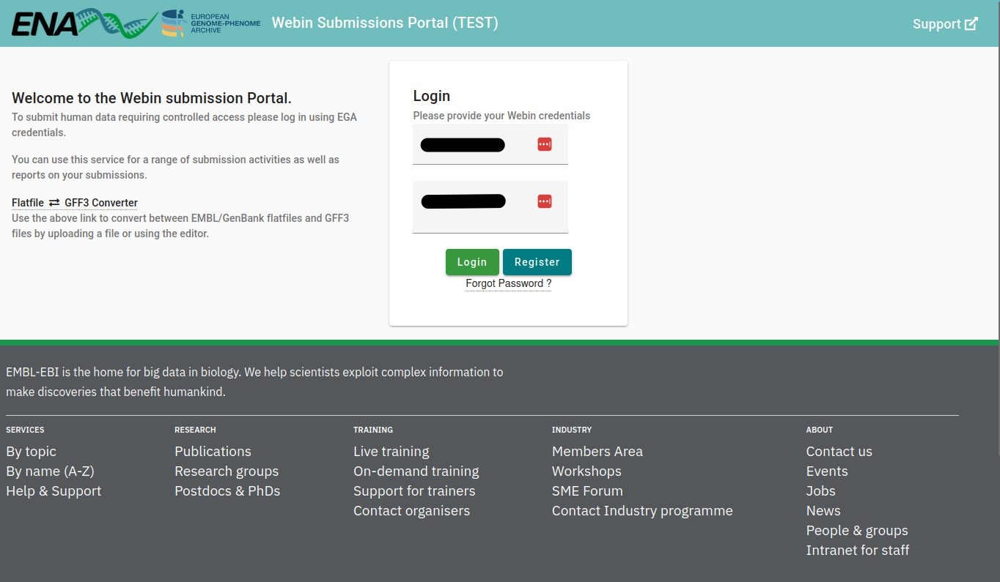
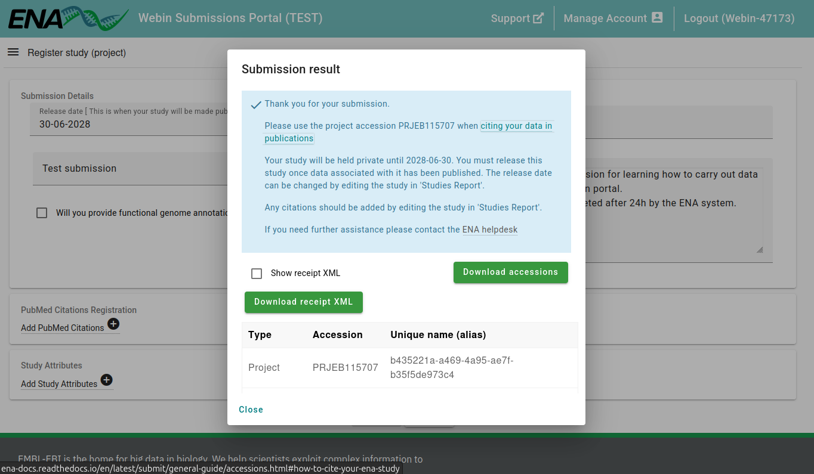
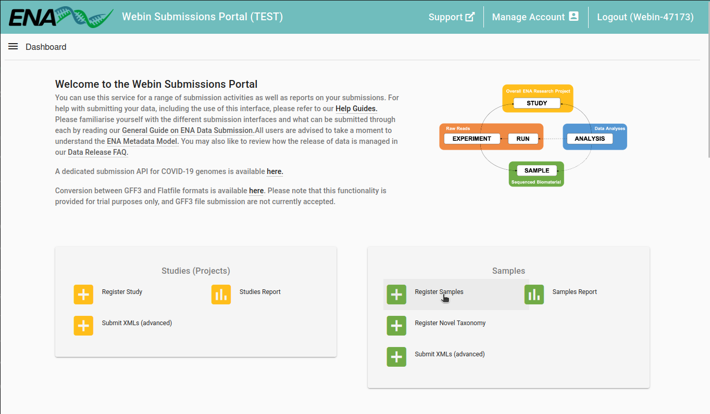
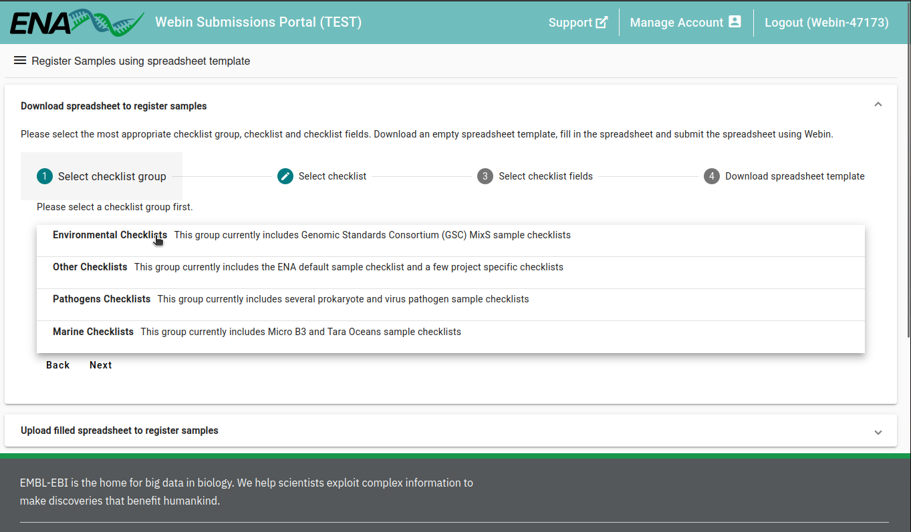
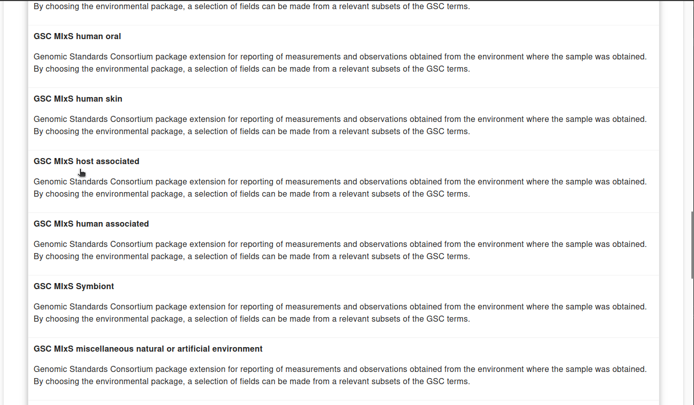
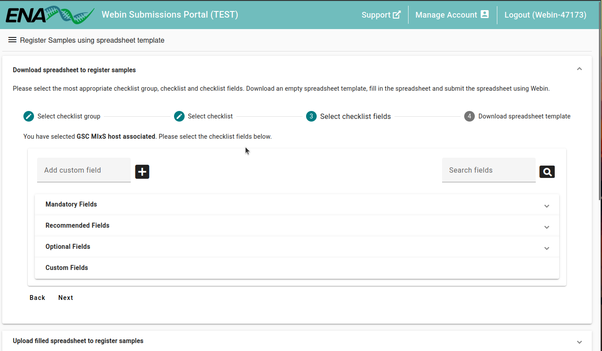
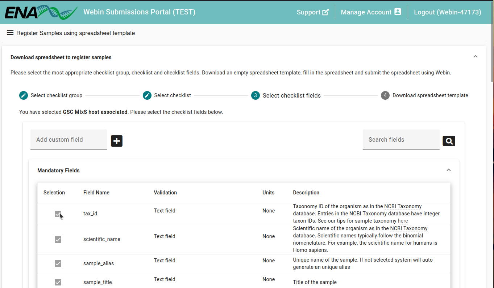

::: {.callout-note collapse="true" title="Self guided: chapter environment setup"}
For this chapter's exercises, if not already performed, you will need to download the chapter's dataset, decompress the archive, and create and activate the Conda environment.

Do this, use `wget` or right-click and save to download this Zenodo archive: [TODO](TODO), and unpack

```bash
tar xvf metadata-and-submitting-to-ena.tar.gz 
cd metadata-and-submitting-to-ena/
```

You can then create the subsequently activate environment with

```bash
conda env create -f metadata-and-submitting-to-ena.yml
conda activate metadata-and-submitting-to-ena
```
:::

## Introduction

### Is ancient metagenomic data FAIR?

The field of ancient DNA has long been a poster child for open data sharing [@Anagnostou2015-mz,@Lien-Talks2024-ia], due to most sequencing data being made publicly available without restrictions for use by other researchers.
However in more recent years, the field has been taking a closer introspective look at the quality of such data uploads.

While the vast majority of data is being made accessible with interoperable formats, the 'findability' and 'reusability' of such data is often limited by the lower quality of the accompanying metadata [@Bergstrom2024-ct,@Bergstrom2024-ka].
Furthermore, many ancient DNA sequencing data files have been inconsistently uploaded without following the guidelines from the repositories themselves [@Fellows_Yates2021-rp].
Much of the contextual information around the data is heterogenously buried in manuscripts themselves, or in supplementary materials in non machine-readable formats, let alone being stored in a searchable manner.

The result of this is that ancient DNA is not 'Findable, Accessible, Interoperable, Reusable' (FAIR) principles compliant [@Wilkinson2016-ou], and thus reducing the full potential for new discoveries from such unique and rare data.
There have been attempts to improve the quality of ancient DNA data through _post hoc_ initiatives such as AncientMetagenomeDir [@Fellows_Yates2021-rp] for ancient metagenomic data, the AADR [@Mallick2024-zz] or Poseidon [@Schmid2024-mo] for human population genomics, or metAaRCive ([https://doi.org/10.5281/zenodo.20085066](https://doi.org/10.5281/zenodo.20085066)) for ancient animal genomics.
However, these projects involve significant efforts to 'curate' and 'clean up' metadata.
Ideally, high-quality metadata should be situated with the data itself, not on external volunteer run databases.

### Metadata standards and the ENA

The [MInAS metadata standard](https://www.mixs-minas.org/) aims to provide a metadata schema that extends and integrates critical metadata for ancient DNA into the existing generalised MIxS metadata standard [@Yilmaz2011-ci].
The MIxS checklists have been adopted by the INSDC collection of repositories, including the European Nucleotide Archive (ENA), the USA's Sequencing Read Archive (SRA), and Japan's DNA Databank of Japan.
Thus, having the ancient metagenomics community use the well-established MIxS checklists, in combination with the required information the ancient DNA field needs, will increase the findability and reusability of ancient metagenomic data in public databases.

### Objectives

This chapter will cover the basics of how to annotate your sample and metagenomic sequencing data with the MInAS MIxS metadata standard, and how to submit your data to the European Nucleotide Archive (ENA).

This chapter is split into three sections:

1. Preparing raw sequencing reads for submission to INSDC 
2. Annotating your samples and raw sequencing reads with metadata, with specific guidance for ancient metagenomic and ancient pathogen data. 
3. Validating and submitting your data to the ENA

Each section will provide example commands, utilising the ENA test data server for validation and submission allowing us to familiarise ourselves with the process without needing to submit our own data.

By the end of the chapter, we will be able to prepare and submit ancient metagenomic and ancient pathogen sequencing data to the ENA, following best practice 'FAIR' principles [@Wilkinson2016-ou] for maximising reproducibility and re-use of our data by other researchers.

::: {.callout-warning title="Scope of chapter"}
This chapter only covers the preparation and submission of raw reads of (predominantly microbial) ancient metagenomes and ancient pathogen sequencing data to the ENA from human, animal, plant, and soil/sediment samples.

It does not cover the preparation of assemblies or genomes as these require different data, quality metadata, and steps.
:::

::: {.callout-note title="ENA vs SRA vs DDBJ"}
For simplicity we focus just on the ENA for this chapter, as the ENA is the most commonly used repository for ancient metagenomic data.
However much of the concept will apply to the other INSDC repositories, which while may vary slightly in their submission process, they all aim to follow the same data sharing principles.
:::

## Set up

This chapter will be simulating the preparation and submission of raw sequencing reads to the ENA, using the ENA test server for validation and submission.

We will be using read clipping tools to get the sequencing data in the requested format by the ENA, and then preparing the metadata spreadsheets.

In addition to the data and software included in the `metadata-and-submitting-to-ena.yml` Conda environment, we will also need:

1. A web browser
2. A free ENA Webin account, which can be created at [https://www.ebi.ac.uk/ena/submit/webin/login](https://www.ebi.ac.uk/ena/submit/webin/login).

::: {.callout-tip title="ENA Webin account"}
A single-user ENA Webin account is not the normal procedure for submitting the data.
Typically it is expected a [single institute or laboratory](https://ena-docs.readthedocs.io/en/latest/submit/general-guide/registration.html) will have a shared single ENA Webin account for multiple users, representing the 'sequencing' or 'submitting' centre.

However for the chapter we will use a single-user account for for training purposes.
:::

In this tutorial we will be simulating a data submission by reusing a small subset of an ancient dental calculus metagenomic dataset [@Fellows_Yates2021-rf], originally uploaded to [PRJEB34569](https://www.ebi.ac.uk/ena/browser/view/PRJEB34569).

This dataset contains a large range of different types of sequencing data, including single-end and paired-end reads, different sequencing machine models, and different library preparation methods.
This variety will allow us to demonstrate the different types of data that can be submitted and annotated to the ENA.

The small subset of the data used in this tutorial includes variation in species, library preparation methods, and sequencing machine models, as well as including a couple of controls.

| study_accession | secondary_sample_accession | sample_alias | scientific_name                | library_name        | Treatment | instrument_model    | library_layout | run_accession |
|-----------------|----------------------------|--------------|--------------------------------|---------------------|-----------|---------------------|----------------|---------------|
| PRJEB34569      | ERS3774455                 | TAF017.E     | Homo sapiens                   | TAF017.E0101        | nUDG      | NextSeq 500         | PAIRED         | ERR3579816    |
| PRJEB34569      | ERS3774455                 | TAF017.E     | Homo sapiens                   | TAF017.E0101.171215 | nUDG      | NextSeq 500         | PAIRED         | ERR3579815    |
| PRJEB34569      | ERS3774465                 | MOA001.A     | Homo sapiens                   | MOA001.A0101        | nUDG      | NextSeq 500         | SINGLE         | ERR3579677    |
| PRJEB34569      | ERS3774419                 | KNP001.A     | Pan troglodytes schweinfurthii | KNP001.A0101        | fUDG      | Illumina HiSeq 4000 | PAIRED         | ERR3579760    |
| PRJEB34569      | ERS4260688                 | EXB033.A0401 | blank sample                   | EXB033.A0401        | fUDG      | Illumina HiSeq 4000 | PAIRED         | ERR3839747    |
| PRJEB34569      | ERS4260707                 | LIB025.A1001 | blank sample                   | LIB025.A1001        | fUDG      | NextSeq 500         | PAIRED         | ERR3839766    |

The study accession and secondary sample accessions refer to the data currently available on the ENA.
However the dataset used in this tutorial are the _submitted_ data, with the original read heads and file names.
Note that the two TAF017.E samples are two sequencing runs of the same library, thus share the same sample accession.

::: {.callout-note title="Ancient pathogen data"}
Note that even though we will be focusing on a shotgun-sequenced ancient microbiome dataset, much of the content of this chapter will also apply to most aDNA data.

We will have specific call-out boxes for guidance on aspects specific to ancient pathogen, so keep an eye out for these! 
:::

## Preparing raw sequencing reads 

### Background

The ENA describes the requirements for raw sequencing reads in their [submission guidelines](https://ena-docs.readthedocs.io/en/latest/submit/fileprep/reads.html).

The relevant formats for most ancient DNA sequencing data are:

- BAM
- FASTQ

In particular, the ENA recommends uploading reads in the 'unmapped BAM' format.
Despite the widespread use of the FASTQ files, the BAM format has an actual format specification, and thus a well-defined validation process to ensure that uploaded reads are in the correct format.
Furthermore, BAM files are a highly compressible binary format for storing sequencing reads, making upload and storage more efficient.

[Unmapped BAM](https://gatk.broadinstitute.org/hc/en-us/articles/360035532132-uBAM-Unmapped-BAM-Format) files are a variant form of a BAM file that does not contain mapping or alignment information (the primary purpose of the BAM family of files).
These are therefore ideal for any type of raw sequencing reads of ancient DNA sample as any ancient DNA sample is _intrinsically_ metagenomic - and does not contain DNA from just a single organism.

It is important to note that regardless of the format we upload, the ENA will always convert back to FASTQ - as the rawest format for sequencing reads.
This is particularly important, as outside of traditional single-species genomics, SAM/BAM/CRAM formats are currently not as widely accepted by bioinformatics tools - such as in taxonomic profiling or metagenomic _de novo_ assembly.

To prepare our reads, we will:

1. Prepare our FASTQ files to follow the ENA requirements using various adapter trimming tools
2. Convert to unmapped BAM format using `samtools`.

### Read preparation overview

The ENA provides clear [specifications](https://ena-docs.readthedocs.io/en/latest/submit/fileprep/reads.html#fastq-format) in which state reads must be before submission.

Most of these are implicit to the FASTQ format as we learnt in the [Introduction to NGS Sequencing](./introduction-to-ngs-sequencing) chapter (e.g., multiples of 4 lines, sequence, read IDs starting with `@`, spacer lines with `+`).

Despite this, some of these implicit (or explicit!) requirements have however not always been followed in the past by ancient DNA researchers.
These common mistakes have been previously reported [@Fellows_Yates2021-rp], and are described here:

- Index, adapter, and barcodes MUST BE removed from the reads
- Paired-end reads MUST NOT be merged
- Multiple libraries from the same sample MUST NOT be merged into a single FASTQ file
- Multiple samples from the same individual MUST NOT be merged into a single FASTQ file

:::{.callout-note title="Why not uploaded partly processed reads" collapse="true"}
Some researchers have argued that they previously uploaded partly processed reads as they represent a more realistic state from which their own analysis was based upon. 
However, as researchers aiming to make our data FAIR, we should aim to upload the rawest form of our data possible.
Instead, reproducibility should be achieved by good documentation and descriptions of how every bit of processing and/or analysis was carried out.

Partly processing data can restricts future researchers from making novel advances.
For example, uploading merging paired-end reads affects researchers today, as it prevents the use of metagenomic _de novo_ assembly tools that require paired-end reads.
It also affects future researchers, who would not be able to use an improved read-merging tool with a better algorithm than the one used by the original researchers. 
:::

In this vein, we will now provide example commands of two commonly used tools for adapter and index removal within ancient DNA, `fastp` and `AdapterRemoval`, to prepare our reads for simulated submission to the ENA.
Follow the section for the tool of our choice.

### Read preparation with fastp

If our read clipping tool of choice is `fastp`, we would run the following command to make our single end data compliant for the ENA:

```bash
fastp \
    -i ERR3579677/MOA001.A0101_S0_L000_R1_000.fastq.gz \
    -o ERR3579677/MOA001.A0101_S0_L000_R1_000_trimmed.fastq.gz \
    -j ERR3579677/MOA001.A0101_S0_L000_R1_000_trimmed_log.json \
    -Q \
    -l 1 \
    --disable_trim_poly_g
```

Let's break this command down:

1. We define the input, output, and log files with `-i`, `-o`, and `-j`, respectively
2. We deactivate quality filtering with `-Q` (ENA does not require any quality trimming or filtering)
3. We specify the minimum read length with `-l 1` (leaving a single base prevents empty reads/lines from adapter only sequence, to ensure we don't violate the multiple of 4 rule)
4. We disable poly-G trimming with `--disable_trim_poly_g` (ENA does not require any quality trimming or filtering)

Note that we have not specified any adapter sequences to remove, as `fastp` will automatically detect and remove adapters from the reads.
If we want to specify our own adapter sequences, we can use the `--adapter_sequence` and `--adapter_sequence_r2` options.

The resulting `ERR3579677/MOA001.A0101_S0_L000_R1_000_trimmed.fastq.gz` is the file will submit to the ENA.

:::{.callout-note}
You will get a message from `fastp` saying 'No adapter detected for read1'.
This is to be expected.
The demo data we are using here is re-downloaded public data passing ENA validation, thus no adapters or barcodes are present on the reads.
:::

Our resulting single-end FASTQ files will be barcode and adapter free, without any other filtering to allow future researchers to improve on data processing while still being ENA compliant.

To make paired-end data compliant for the ENA, we would run the following command:

```bash
fastp \
    -i ERR3579815/TAF017.E0101.171215_S0_L000_R1_000.fastq.gz \
    -I ERR3579815/TAF017.E0101.171215_S0_L000_R2_000.fastq.gz \
    -o ERR3579815/TAF017.E0101.171215_S0_L000_R1_000_trimmed.fastq.gz \
    -O ERR3579815/TAF017.E0101.171215_S0_L000_R2_000_trimmed.fastq.gz \
    -j ERR3579815/TAF017.E0101.171215_S0_L000_R2_000_trimmed_log.json \
    -Q \
    -l 1 \
    --disable_trim_poly_g
```

The command is the same as for single-end data, except we add the second read's FASTQ with `-I` and `-O` for input and output respectively.

The resulting `ERR3579677/TAF017.E0101.171215_S0_L000_R1_000_trimmed.fastq.gz` and `ERR3579677/TAF017.E0101.171215_S0_L000_R2_000_trimmed.fastq.gz` are the read 1 and read 2 files we will submit to the ENA.


:::{.callout-note}
In this case we will see a message from `fastp` saying 'reads with adapter trimmed <number>'.
This is also to be expected!
While the demo data we are using here is re-downloaded public data passing ENA validation, this demonstrates how adapter clipping tools may not always work perfectly.
In the future, updated bioinformatics tools may provide better accuracy so we should as a general rule leave the rawest form of our data for future researchers to reprocess.

Note however we still make a best effort to remove adapters and barcodes specifically (rather than leaving them for future researchers), as this is requested by the ENA guidelines.
:::

We can now run the same command for the remaining files in our example dataset.

```bash
fastp -i ERR3579760/KNP001.A0101_S0_L000_R1_000.fastq.gz -I ERR3579760/KNP001.A0101_S0_L000_R2_000.fastq.gz -o ERR3579760/KNP001.A0101_S0_L000_R1_000_trimmed.fastq.gz -O ERR3579760/KNP001.A0101_S0_L000_R2_000_trimmed.fastq.gz -j ERR3579760/KNP001.A0101_S0_L000_000_trimmed_log.json -Q -l 1 --disable_trim_poly_g
fastp -i ERR3579816/TAF017.E0101_S0_L000_R1_000.fastq.gz -I ERR3579816/TAF017.E0101_S0_L000_R2_000.fastq.gz -o ERR3579816/TAF017.E0101_S0_L000_R1_000_trimmed.fastq.gz -O ERR3579816/TAF017.E0101_S0_L000_R2_000_trimmed.fastq.gz -j ERR3579816/TAF017.E0101_S0_L000_000_trimmed_log.json -Q -l 1 --disable_trim_poly_g
fastp -i ERR3839747/EXB033.A0401_S0_L000_R1_000.fastq.gz -I ERR3839747/EXB033.A0401_S0_L000_R2_000.fastq.gz -o ERR3839747/EXB033.A0401_S0_L000_R1_000_trimmed.fastq.gz -O ERR3839747/EXB033.A0401_S0_L000_R2_000_trimmed.fastq.gz -j ERR3839747/EXB033.A0401_S0_L000_000_trimmed_log.json -Q -l 1 --disable_trim_poly_g
fastp -i ERR3839766/LIB025.A1001_S0_L000_R1_000.fastq.gz -I ERR3839766/LIB025.A1001_S0_L000_R2_000.fastq.gz -o ERR3839766/LIB025.A1001_S0_L000_R1_000_trimmed.fastq.gz -O ERR3839766/LIB025.A1001_S0_L000_R2_000_trimmed.fastq.gz -j ERR3839766/LIB025.A1001_S0_L000_000_trimmed_log.json -Q -l 1 --disable_trim_poly_g
```

### Read preparation with AdapterRemoval

If our read clipping tool of choice is `AdapterRemoval` (v2), we would run the following command to make our single end data compliant for the ENA:

```bash
AdapterRemoval \
    --file1 ERR3579677/MOA001.A0101_S0_L000_R1_000.fastq.gz \
    --basename ERR3579677/MOA001.A0101_S0_L000_R1_000_trimmed \
    --gzip \
    --minlength 1
```

Let's break this command down:

1. We define the input file with `--file1` and output name with `--basename`
2. We specify to gzip the output with `--gzip` (as required by the ENA)
3. We set the minimum length to 1 (leaving a single base prevents empty reads/lines from adapter only sequence, to ensure we don't violate the multiple of 4 rule)

Note that we have not specified any adapter sequences to remove, as `AdapterRemoval` has it's own [defaults sequences](https://adapterremoval.readthedocs.io/en/2.3.x/manpage.html#fastq-trimming-options) for common Illumina adapters.
We can also define our own adapters with `--adapter1`, `--adapter2`, or `--adapter-list`.
Note that the `--identify-adapters` only reports possible sequences, it does not remove them like `fastp`!

:::{.callout-note}
If we inspect the `*settings` file we may see a number of reads still with adapters, even though this is re-downloaded public data already passing the ENA validation.
This demonstrates how adapter clipping tools may not always work perfectly.
In the future, updated bioinformatics tools may provide better accuracy so we should as a general rule leave the rawest form of our data for future researchers to reprocess.

Note however we still make a best effort to remove adapters and barcodes specifically (rather than leaving them for future researchers), as this is requested by the ENA guidelines.
:::

You will then have three output files: 

- `ERR3579677/MOA001.A0101_S0_L000_R1_000_trimmed.discarded.gz`: in this case, empty as no quality or length filtering was performed 
- `ERR3579677/MOA001.A0101_S0_L000_R1_000_trimmed.settings`: reports and statistics of the trimming process
- `ERR3579677/MOA001.A0101_S0_L000_R1_000_trimmed.truncated.gz`: the trimmed reads (the one we will upload!)

To make paired-end data compliant for the ENA, we would run the following command:

```bash
AdapterRemoval \
    --file1 ERR3579815/TAF017.E0101.171215_S0_L000_R1_000.fastq.gz \
    --file2 ERR3579815/TAF017.E0101.171215_S0_L000_R2_000.fastq.gz \
    --basename ERR3579815/TAF017.E0101.171215_S0_L000_trimmed \
    --gzip \
    --minlength 1
```

The command is essentially the same as for single-end data, except we add the second read's FASTQ with `--file2`.

:::{.callout-note}
If we inspect the `*settings` file we may see a number of reads still with adapters, even though this is re-downloaded public data already passing the ENA validation.
This demonstrates how adapter clipping tools may not always work perfectly.
In the future, updated bioinformatics tools may provide better accuracy so we should as a general rule leave the rawest form of our data for future researchers to reprocess.

Note however we still make a best effort to remove adapters and barcodes specifically (rather than leaving them for future researchers), as this is requested by the ENA guidelines.
:::

This time we have more output files:

- ERR3579815/TAF017.E0101.171215_S0_L000_trimmed.discarded.gz: in this case, empty as no quality or length filtering was performed 
- ERR3579815/TAF017.E0101.171215_S0_L000_trimmed.pair1.truncated.gz: the trimmed R1 reads (the one we will upload!)
- ERR3579815/TAF017.E0101.171215_S0_L000_trimmed.pair2.truncated.gz: the trimmed R2 reads (the one we will upload!)
- ERR3579815/TAF017.E0101.171215_S0_L000_trimmed.settings: reports and statistics of the trimming process
- ERR3579815/TAF017.E0101.171215_S0_L000_trimmed.singleton.truncated.gz: left-over reads where one read in pair was discarded. In this case, empty as no quality or length filtering was performed.

We can now run the same command for the remaining files in our example dataset.

```bash
AdapterRemoval --file1 ERR3579760/KNP001.A0101_S0_L000_R1_000.fastq.gz --file2 ERR3579760/KNP001.A0101_S0_L000_R2_000.fastq.gz --basename ERR3579760/KNP001.A0101_S0_L000_000_trimmed --gzip --minlength 1
AdapterRemoval --file1 ERR3579816/TAF017.E0101_S0_L000_R1_000.fastq.gz --file2 ERR3579816/TAF017.E0101_S0_L000_R2_000.fastq.gz --basename ERR3579816/TAF017.E0101_S0_L000_000_trimmed --gzip --minlength 1
AdapterRemoval --file1 ERR3839747/EXB033.A0401_S0_L000_R1_000.fastq.gz --file2 ERR3839747/EXB033.A0401_S0_L000_R2_000.fastq.gz --basename ERR3839747/EXB033.A0401_S0_L000_000_trimmed --gzip --minlength 1
AdapterRemoval --file1 ERR3839766/LIB025.A1001_S0_L000_R1_000.fastq.gz --file2 ERR3839766/LIB025.A1001_S0_L000_R2_000.fastq.gz --basename ERR3839766/LIB025.A1001_S0_L000_000_trimmed --gzip --minlength 1
```

### Read preparation with other tools

If you have a different read clipping tool of choice, we can use that instead.
The important thing is that the resulting reads are in a state that is compliant with the ENA requirements, as described above.
Most read processing tools will support similar parameters for both `fastp` and `AdapterRemoval`, so we should be able to adapt the commands above to our tool of choice.

Remember: the most important thing is to do as little processing as possible (no read merging, quality filtering/trimming, etc.) to ensure the rawest form of our data is uploaded to the ENA.
Just remove adapters, barcodes, or other synthetic technical sequences - and we should be ready!

### Format conversion

Now that our reads are in the correct state, we can convert them to unmapped BAM format using `samtools`.

We can use the `samtools import` command as follows.

For single end data run:

```bash
## DO NOT RUN
samtools import -s <samplename>.fastq.gz -O BAM -o <samplename>.bam
```

For paired-end data run:

```bash
## DO NOT RUN
samtools import -1 <samplename>.fastq.gz -2 <samplename>.fastq.gz -O BAM -o <samplename>.bam
```

Thus for our example dataset, we can run the following for the single-end sample to generate unmapped BAM format:

```bash
samtools import -s ERR3579677/MOA001.A0101_S0_L000_R1_000_trimmed.fastq.gz -O BAM -o ERR3579677/MOA001.A0101_S0_L000_R1_000_trimmed.bam
```

:::{.callout-warning}
Make sure to update the FASTQ file names in the commands if you used different read clipping tools!
The examples here are from using `fastp`, but if we used `AdapterRemoval` or another tool, the FASTQ file names may be different.
:::

If you want to validate the resulting BAM file, we can first generate some statistics on the FASTQ file with `seqkit stats`: 

```bash
seqkit stats ERR3579677/MOA001.A0101_S0_L000_R1_000_trimmed.fastq.gz
```
```bash
file                                                     format  type   num_seqs     sum_len  min_len  avg_len  max_len
ERR3579677/MOA001.A0101_S0_L000_R1_000_trimmed.fastq.gz  FASTQ   DNA   1,240,487  74,677,661        1     60.2       76
```

Then compare the numbers in the resulting BAM file with `samtools flagstat`:

```bash
samtools flagstat ERR3579677/MOA001.A0101_S0_L000_R1_000_trimmed.bam | head -n 7
```
```bash
1240487 + 0 in total (QC-passed reads + QC-failed reads)
1240487 + 0 primary
0 + 0 secondary
0 + 0 supplementary
0 + 0 duplicates
0 + 0 primary duplicates
0 + 0 mapped (0.00% : N/A)
```

Furthermore, If we inspect the contents of the resulting BAM file with samtools, we see we retain all the information needed to generate a FASTQ file, namely the read ID, the DNA sequence itself and the quality scores.

```bash
samtools view ERR3579677/MOA001.A0101_S0_L000_R1_000_trimmed.bam | head -n 4
```
```
NS500382:52:HGVMGBGXY:1:11101:19213:1069	4	*	0	0	*	*	0	0	CAGAATTGTATACTCGTCACCGGGCTTCATGTCCGGTGCGACGTACTCATGTACGTCCAAAGCCTGACGATATTT	AAAAAEEEEEEEEEEAEEEEEEAEEEEEEEEEAEEEEEEE/EEEEEEEEEEEAEEE<AEE6EEEEEEEEEEEEEE
NS500382:52:HGVMGBGXY:1:11101:16668:1078	4	*	0	0	*	*	0	0	TTTGGAAAAATACGGATGGAAAGATCGAAGTCTTTCACCGTTATATGATTCCGGGACGGTCAACGCCGTATAATAT	AAA6AEEEEE/AAEE/E/EEEAEEEEA<E/EAEE/E/EA<AA/EE//EAE6/E//EA//E/6E6//EEEEE/E<AE
NS500382:52:HGVMGBGXY:1:11101:20127:1100	4	*	0	0	*	*	0	0	GTTAAACAGAAGGCTGCAGCTTATTAAAATAAT	AAAAAEEEE/EEEEEEEEEEAEEEEEEEEEEEE
NS500382:52:HGVMGBGXY:1:11101:10521:1116	4	*	0	0	*	*	0	0	GATAACATTCGTCTTTCCAAGGCGGTGAAGAAGCAGGTTGCAGATGATGAGACGGAACTTGA	AAAAAEEEEEEEEEEEEEEEEEA<AEEEEEAEEEEEEEEEEEEEE6EEEE/EEEEEEEEAEE
```

The same goes for paired-end data, where we can run the following to generate unmapped BAM format:

```bash
samtools import -1 ERR3579815/TAF017.E0101.171215_S0_L000_R1_000_trimmed.fastq.gz -2 ERR3579815/TAF017.E0101.171215_S0_L000_R2_000_trimmed.fastq.gz -O BAM -o ERR3579815/TAF017.E0101.171215_S0_L000_000_trimmed.bam
```

Generate some statistics on the FASTQ file with `seqkit stats`: 

```bash
seqkit stats ERR3579815/TAF017.E0101.171215_S0_L000_R1_000_trimmed.fastq.gz
seqkit stats ERR3579815/TAF017.E0101.171215_S0_L000_R2_000_trimmed.fastq.gz
```
```bash
file                                                            format  type  num_seqs    sum_len  min_len  avg_len  max_len
ERR3579815/TAF017.E0101.171215_S0_L000_R1_000_trimmed.fastq.gz  FASTQ   DNA     32,412  2,005,141        1     61.9       76
file                                                            format  type  num_seqs    sum_len  min_len  avg_len  max_len
ERR3579815/TAF017.E0101.171215_S0_L000_R2_000_trimmed.fastq.gz  FASTQ   DNA     32,412  1,998,083        1     61.6       76

```

Then compare the numbers in the resulting BAM file with `samtools flagstat`:

```bash
samtools flagstat ERR3579815/TAF017.E0101.171215_S0_L000_000_trimmed.bam | head -n 7
```
```bash
64824 + 0 in total (QC-passed reads + QC-failed reads)
64824 + 0 primary
0 + 0 secondary
0 + 0 supplementary
0 + 0 duplicates
0 + 0 primary duplicates
0 + 0 mapped (0.00% : N/A)
```

With the sum of the reads in two FASTQ files matching the total number of reads in the resulting BAM file.

And finally if we look inside the BAM file, we see each read pair are grouped together.

```bash
samtools view ERR3579815/TAF017.E0101.171215_S0_L000_000_trimmed.bam | head -n 4
```
```
NS500382:60:HKGL5BGX3:1:11101:15454:2507	77	*	0	0	*	*	0	0	GGACCTGCTTGAGGCGACCGCGCTCGGAGGGGTGGACGACGACAT	AAAAAEEEEEEEEEEEEEEEEEEEAEEEEEEEEEEEEEEEEEEEE
NS500382:60:HKGL5BGX3:1:11101:15454:2507	141	*	0	0	*	*	0	0	ATGTCGTCGTCCACCCCTCCGAGCGCGGTCGCCTCAAGCAGGTC	AAAAAEEEEEE/A<EEEEEAEEAAEEEEEEEEEEEE6AEEEEEE
NS500382:60:HKGL5BGX3:1:11101:9496:2915	77	*	0	0	*	*	0	0	GGATCACGATCGGGCGTTCCAGGACCGGCGGCTTTAAGGGCT	AAAAAEEEEEEEEEEEEEEEEEEEEEEEEEEEEEEEEEEEEE
NS500382:60:HKGL5BGX3:1:11101:9496:2915	141	*	0	0	*	*	0	0	AGCCCTTAAAGCCGCCGGTCCTGGAACGCCCGATCGTGATCC	AAAAAEEEEEEEEEEEEEEEEEEEEEEEEEEEEEEEEEEEEE
```

To generate the rest of our BAM files:

```bash
samtools import -1 ERR3579760/KNP001.A0101_S0_L000_R1_000_trimmed.fastq.gz -2 ERR3579760/KNP001.A0101_S0_L000_R2_000_trimmed.fastq.gz -O BAM -o ERR3579760/KNP001.A0101_S0_L000_000_trimmed.bam
samtools import -1 ERR3579816/TAF017.E0101_S0_L000_R1_000_trimmed.fastq.gz -2 ERR3579816/TAF017.E0101_S0_L000_R2_000_trimmed.fastq.gz -O BAM -o ERR3579816/TAF017.E0101_S0_L000_000_trimmed.bam
samtools import -1 ERR3839747/EXB033.A0401_S0_L000_R1_000_trimmed.fastq.gz -2 ERR3839747/EXB033.A0401_S0_L000_R2_000_trimmed.fastq.gz -O BAM -o ERR3839747/EXB033.A0401_S0_L000_000_trimmed.bam
samtools import -1 ERR3839766/LIB025.A1001_S0_L000_R1_000_trimmed.fastq.gz -2 ERR3839766/LIB025.A1001_S0_L000_R2_000_trimmed.fastq.gz -O BAM -o ERR3839766/LIB025.A1001_S0_L000_000_trimmed.bam
```

## Submission test environment

With the reads prepared we can now prepare the metadata for our samples and reads for our test submission to the ENA.

The ENA provides a test environment [https://wwwdev.ebi.ac.uk/ena/submit/webin](https://wwwdev.ebi.ac.uk/ena/submit/webin) for users to familiarise themselves with the submission process without needing to submit their own data.

Everything submitted to this test server will deleted after 24 hours, so this is perfect to get familiar with the system before uploading our data for real. 

:::{.callout-danger}
Verify across all the following sections that we are using the development 'test' environment website for testing!

Do not submit anything to the production website!

- Test URL: https://wwwdev.ebi.ac.uk/ena/submit/webin/
- Production URL: https://www.ebi.ac.uk/ena/submit/webin
:::

First log in to the ENA Webin test environment with your single-person ENA Webin account.

{#fig-metadatasubmittingena-1-webin-testenv-login.png}

Once logged in, we will be in the landing page of the ENA's Webin (test) portal. 

{#fig-metadatasubmittingena-2-webin-testenv-landing.png}

On this page we will find some basic information and then different boxes with buttons corresponding to the major steps of the ENA submission cycle, namely:

1. Registering studies
2. Registering samples
3. Registering raw reads (with experiment and run metadata)
4. Registering data analyses
5. Tools

In this tutorial we will be addressing steps 1 to 3, as we are focusing on the submission of raw sequencing reads, rather than assemblies and genomes (which fall under the 'Data Analyses' step).
We will use the Webin browser interface for registering studies and samples, and the `ena-webin-cli` command line tool for submitting the data itself.

## Project metadata

An ENA study is the highest level of a submission.
This typically (but not strictly!) corresponds to a single scientific publication.
A study represents a collection of samples, experiments, and runs.
Note that runs can be associated with multiple projects, even if the sample was originally submitted with an earlier project!

To create a new study, press the 'Register study' button.
In this page, we will find four sections:

- Release date
  - Set to the date when the data should be made public.
  - Typically date of publication, but possibly earlier if requested by reviewers.
  - Note that we can later adjust this release date (bring forward, or later)
- Study name
  - A short title of the study, only really used for display purposes in the ENA Webin portal itself
- Name of study
  - A long-form title of the study.
  - Typically corresponds to the title of the publication.
  - Displayed in the ENA browser and search results.
- Description of study
  - A longer more detailed description of the study.
  - Typically corresponds to the abstract of the publication.

As we are submitting only raw reads of a metagenome, we do not need to tick 'Will you provide functional genome annotation?'
The PubMed Citations Registration and Study Attributes sections are optional, can be updated later after submission.

{#fig-metadatasubmittingena-3-webin-testenv-registerstudy}

Once we the press Submit button, we will get a 'Submission result' window, which confirms the newly assigned project accession ID as well as confirming the release date of the data.
In particular we should note down our project accession ID, this is what we will report in our publication's 'Data availability' statement.

You also get offered a 'Download accessions' and a 'Download receipt XML' button.
Download both of these files, and store them safety for future reference.

{#fig-metadatasubmittingena-4-webin-testenv-studysuccess}

The accession `.txt` file contains a cofirmation of the projetct acession and the internal ENA submission ID

```tsv
TYPE	ACCESSION	ALIAS
PROJECT	PRJEB115707	b435221a-a469-4a95-ae7f-b35f5de973c4
SUBMISSION	ERA36589854	SUBMISSION-30-06-2026-13:50:24:290
```

The `.xml` file contains the same information with a few additional IDs and information about the submission.
This can be useful if we need to contact ENA staff for support with our submission.

```xml
<?xml version="1.0" encoding="UTF-8"?>
<?xml-stylesheet type="text/xsl" href="receipt.xsl"?>
<RECEIPT receiptDate="2026-06-30T13:50:24.337+01:00" submissionFile="submission.xml" success="true">
     <PROJECT accession="PRJEB115707" alias="b435221a-a469-4a95-ae7f-b35f5de973c4" status="PRIVATE" holdUntilDate="2028-06-30+01:00">
          <EXT_ID accession="ERP195904" type="study"/>
     </PROJECT>
     <SUBMISSION accession="ERA36589854" alias="SUBMISSION-30-06-2026-13:50:24:290"/>
     <MESSAGES>
          <INFO>All objects in this submission are set to private status (HOLD).</INFO>
          <INFO>This submission is a TEST submission and will be discarded within 24 hours</INFO>
     </MESSAGES>
     <ACTIONS>ADD</ACTIONS>
     <ACTIONS>HOLD</ACTIONS>
</RECEIPT>
```

## Sample metadata

Once we have registered oour study, we can move onto registering our samples.

This is the most time consuming, but arguably the most important and useful part of the submission process.

:::{.callout-tip}
If at any point we need the full definition or more examples for any of the MIxS or MInAS terms, see the respective project websites:

- [MIxS](https://genomicsstandardsconsortium.github.io/mixs/term_list/)
- [MInAS](https://www.mixs-minas.org/extension-ancient/#slots)
:::

To register a sample, go to the Webin portal (making we're still in the TEST environment!) and press the 'Register sample' button.

{#fig-metadatasubmittingena-5-webin-testenv-landingsamples}

### Selecting a checklist

We will be presented with a 'wizard' to help us select the most relevant metadata checklist for our samples.
All ancient DNA samples are intriniscally metagenomic, so we will select the 'Environmental checklists' option.
Note that all MIxS checklists fall under 'Environmental Checklists', including the MInAS checklists.

{#fig-metadatasubmittingena-6-webin-testenv-samplechecklistgroup}

In the resulting list, we will need to select the most appropriate MIxS checklist for our samples.
Take the time to explore the different checklists to find the most appropriate one for our samples.
However, avoid the 'ENA default checklist' as far as possible - even if it is the easiest to fill in.
You will be greatly reducing the value of our data by removing much of the contextal information useful for making our data findable in the public repositories.

For the puroposes of this tutorial, we will select the MIxS HostAssociatedAncient checklist, as our samples are from a host-associated environment (the oral cavity of humans and Chimpanzees).

{#fig-metadatasubmittingena-7-webin-testenv-samplechecklistselection}

:::{.callout-note title="Studies with mixtures of sample types"}
It is completely valid to fill in multiple checklists for different sample types within the same study.
For example, in our dummy data we have ancient oral microbiome sequencing data from both humans and Chimpanzees.

We theoretically could have used the GSC MIxS HumanOralAncient checklist for the human samples, and the GSC MIxS HostAssociatedAncient checklist for the Chimpanzee samples. 
However for the purposes of this tutorial, we will fill out just the GSC MIxS HostAssociatedAncient checklist for all samples as the human specific metadata terms are mostly for clinical contexts.
:::

Once we select the checklist, we will be presented with the option to select which Mandatory, Recommended, and Optional fields we want to fill in for our samples.

{#fig-metadatasubmittingena-8-webin-testenv-fieldgroups}

{#fig-metadatasubmittingena-9-webin-testenv-termselection}

Not all fields will be applicable or even possible to fill in for ancient samples, depending on the specific definition of the metadata term.
However, we want to fill in as many fields as possible, to maximise the contextual information that will be associated with our sequencing data.

In the rest of this section we will provide some guidance on how to fill in the fields for ancient metagenomic samples.

:::{.callout-tip title="Custom fields"}
The ENA sample checklist system also allows us to include our own custom metadata fields!
The main difference is these will not be validated.
This means we are welcome to use (and extend) the checklists for our own supplementary tables with study-specific information, as well as or ENA sample registration at the same time!
:::

To simplify this submission, we will use this [spreadsheet template](assets/data/metadata-and-submitting-to-ena/MimsHostAssociatedAncient-ena.tsv) to fill in the metadata for our samples.
A completed version for our data we can see here [MimsHostAssociatedAncient-]() <!-- TODO to make and add-->

### ENA specific metadata terms

The first set of mandatory fields we will encounter are specific to the ENA.
These are not necessarily represented within the MIxS standards, however are required for internal processing with the ENA.
These terms are mostly distinguishable from the MIxS terms as they use `_` in the column title rather than spaces (with the exception of the geographic location terms).

#### tax_id

`tax_id` is the first of many taxonomy IDs that can be assigned to a sample or run.
The taxonomy ID is required to come from the NCBI Taxonomy database (https://www.ncbi.nlm.nih.gov/datasets/taxonomy/).
This higher-level ENA specific `tax_id` term refers to the taxonomic contents of the DNA in the sample.
For modern isolate or tissue samples, the DNA is almost exclusively from the organism.
In contrast, all ancient DNA samples are intrinsically made up of many oraganism from the 'necrobiome' or all the organisms involved in the decomposition of the body as well as organisms from the burial and/or storage environment.

:::{.callout-tip}
Do not worry about how to specify host, or capture-probe taxon IDs just yet!
We specify will these later.
:::

We should use the special '[environmental taxonomic classifications](https://ena-docs.readthedocs.io/en/latest/faq/taxonomy.html#environmental-taxonomic-classifications)' set of metagenome taxonomic IDs for ancient samples.
We can see these specified on the NCBI browser as child-taxonomy IDs under the `organismal metagenome` taxonomy ID ([410656](https://www.ncbi.nlm.nih.gov/datasets/taxonomy/browser/?taxon=410656)).
We should try to be as specific as we can.
For our dummy data set of ancient dental calculus, we will use the `human oral metagenome` taxonomy ID ([447426](https://www.ncbi.nlm.nih.gov/datasets/taxonomy/447426/)) for the human samples, and the `primate metagenome` taxonomy ID ([1441288](https://www.ncbi.nlm.nih.gov/datasets/taxonomy/1441288/)) for the chimpanzee sample.

For other common ancient sample types, we could use the following taxids:
<!-- TODO check for most common sample types on AncientMetagenomeDir and update -->
- `human metagenome` ([646099](https://www.ncbi.nlm.nih.gov/datasets/taxonomy/646099/))
- `human gut metagenome` ([408170](https://www.ncbi.nlm.nih.gov/datasets/taxonomy/408170/))
- `human skeleton metagenome` ([1892068](https://www.ncbi.nlm.nih.gov/datasets/taxonomy/1892068/))
- `mammal metagenome` ([3127350](https://www.ncbi.nlm.nih.gov/datasets/taxonomy/3127350/))
- `plant metagenome` ([1297885](https://www.ncbi.nlm.nih.gov/datasets/taxonomy/1297885/))
- `sheep metagenome` ([1898966](https://www.ncbi.nlm.nih.gov/datasets/taxonomy/1898966/))
- `canine gut metagenome` ([2951411](https://www.ncbi.nlm.nih.gov/datasets/taxonomy/2951411/))

Note that we may come across the `fossil metagenome` entry in the NCBI taxonomy.
We do not recommend this as it is not well defined, and the other entries are often more descriptive.

For negative controls, we can use the dedicated `blank sample` taxon [2582415](https://www.ncbi.nlm.nih.gov/datasets/taxonomy/2582415/).

If we do not find a taxonomy entry that we think is appropriate for our sample, we can [request new IDs](https://ena-docs.readthedocs.io/en/latest/faq/taxonomy_requests.html).

#### scientific_name

`scientific_name` corresponds to the name associated with the taxonomy ID specified in the `tax_id` column.
We should make sure the name we enter here matches that of the scientific name as recorded on the NCBI taxonomy database.

#### geographic location (latitude) and geographic location (longitude)

These terms are derived from the MIxS standard, however split into two separate columns.
These fields _do not_ necessarily correspond to the geographic location of the site the sample was originally buried!

The [ENA guidance states](https://ena-docs.readthedocs.io/en/latest/faq/spatiotemporal-metadata.html#i-have-an-ancient-dna-sample-how-do-i-provide-the-spatiotemporal-information-for-my-sample-which-location-and-date-should-be-reported) that these coordinates refer to the place the sample was taken for the purposes of sequencing.
Essentially this means these fields should be specified as the location of the museum, herbarium, or collection the samples were stored in.
Only in cases where we sampled directly from the field specifically for sequencing should we specify the coorindation of the field site (e.g. with sediment or soil samples).

For negative controls, this would correspond to the laboratory where the negative control was processed.

Precision to 3 decimal places is normally sufficient (e.g., `40.712`), but we can go less specific if nececessary. 

:::{.callout-tip}
Do not worry about how to specify the original location just yet!
We specify will these later.
:::

## geographic location (country and/or sea)

`geographic location (country and/or sea)` corresponds to the name of the country or sea that the geographic coordinates correspond to.
This is specified via a controlled list maintained by the [INSDC](https://www.insdc.org/submitting-standards/geo_loc_name-qualifier-vocabulary/) (the body that coordinates between the ENA, SRA, and DDBJ).

:::{.callout-tip}
In cases of political uncertainty, we may find the specific name of the country not listed.
Pick the closest location in the list that covers the area specified in the coordinates.
:::

#### sample_title

`sample_title` is a short name of the title of the sample, typically the sample ID or name used in the publication.
Can be a duplicate of `sample_alias`.

#### sample_description

`sample_description` is a longer form free-text description of exactly what the sample is.
This could be a description of the sample type, the tissue sampled, the organism.
Here is a good place to explicitly state that this is an ancient sample, e.g. archaeological or palaeoecological in origin.
For our example, we can use descriptions such as `Dental calculus from ancient human skeleton`, `Dental calculus from historical chimpanzee dentition`.

For controls, we can specify what type of control and the material.
For example: `Water negative extraction control`.

#### project name

`project name` is a short name of the project, typically the same as the study name we registered in the previous step.

The remaining mandatory fields are defined in the MIxS terms.

### Environment metadata

After the mandatory ENA specific fields, we will encounter the MIxS environmental metadata terms.
These can be considered to describe the location from which the sample was at the time of sampling.
The MInAS set of ancient DNA specific terms extends these terms to include terms dedicated to the natural environment the sample was in, _in the past_, for example at the time of burial. 

#### relevant electronic resources

`relevant electronic resources` is a catch-all field that allows us to specify any URL or DOI that could we feel could be relevant contextual information about the site, sample, or sequencing reads.
Typically this would be things such publications describing the site, or the osteological analysis of skeletons, or other analysis performed on the same sample (e.g. dating).

This is an optional field, and so we only need to fill it in if we feel the information is highly relevant for the intepretation sequencing data.

#### name of site or location where sample originated

[`name of site or location where sample originated`](https://www.mixs-minas.org/extension-ancient/orig_site_name/)** this column is where we can put the name of the archaeological or palaeocological site from which the ancient sample was obtained.
This can be a non-geographic name, such as the offiical name of the excavation or field station, or even a colloquial name, as long as it is referred to in the literature.
If we do not have this information - no site, very old museum sample, negative controls - we can leave this field blank.

#### original site location

[`original site location`](https://www.mixs-minas.org/extension-ancient/orig_site_loc)** is the geographic location of the site where the sample was originally present in its burial environment (i.e., the name we can find on a map).
Compared to the previous `geographic location` column, this is NOT the museum or collection.
This is different from the `name of site or location` in that the local and region in this column _should_ match (official) geographic places on a map.

In cases where there is not a modern-day explicit name of the area, use the closest village, town, or city name or the region.
If we do not have this information (for example, if the samples were deposited in a museum in the 1800s with minimimal contextual information, or we are describing blanks), we can leave this field blank.

For negative controls, we can either leave blank or duplicate the site location.

This should be formatted as `<country>: <region>, <nearest town or village/geographic name>`'.

:::{.callout-tip}
A fast 'guide' for what to add to this field can be _Can we find the place name on Google maps?_.
:::

#### original geographic location (latitude) and original geographic location (longitude)

[`original geographic location (latitude)`](https://www.mixs-minas.org/extension-ancient/orig_site_lat/) and [`original geographic location (longitude)`](https://www.mixs-minas.org/extension-ancient/orig_site_lon/) are derived from the MInAS MIxS extension, again split into two separate columns.
These 'original' prefixed fields refer to the geographic location of the site the sample was originally buried (and thus the site name, and original site location)!

For negative controls, this would correspond to the laboratory where the negative control was processed.

Precision to 3 decimal places is normally sufficient (e.g. `1.213`), but we can go less specific if nececessary. 
If we cannot provide the exact location, we can use a mid-point of a region with a lower decimal precision of the coordinates.

For negative controls, we can either leave blank or duplicate the site location.

#### broad-scale past environmental context

[`broad-scale past environmental context`](https://www.mixs-minas.org/extension-ancient/past_env_broad/) refers to the general environmental ecosystem, ecozone, or ecoregion, _when the ancient organism was alive and/or at the time of burial in the past_ (or in case of inorganic material, when it was manufactured or used in the past).
Think along the lines of the level of a: desert, forest, or urban environment.
The [ENVO guidance](https://github.com/EnvironmentOntology/envo/wiki/Using-ENVO-with-MIxS) that for use with the MIxS standard, the 'broad-scale' context should correspond to a subclass of the [ENVO 'biome' class](https://www.ebi.ac.uk/ols4/ontologies/envo/classes/http%253A%252F%252Fpurl.obolibrary.org%252Fobo%252FENVO_00000428?lang=en).
If you are unsure what type of biome to specify, and know there has not been major ecosystem change over time, we can find the site of our sample using maps that overlay global biomes or ecosystems (for example: [Mapscaping](https://mapscaping.com/interactive-global-biomes-map/#google_vignette), [Data basin](https://databasin.org/maps/new/#datasets=68635d7c77f1475f9b6c1d1dbe0a4c4c), [One Earth](https://www.oneearth.org/navigator/)), and search for like terms to the biome described on the map on the ENVO ontology. 

If the sample was taken from a museum or collection, and we have little information about the original depositional environment, we can try to approximate this based on the modern day geographic location.
For example, if the sample was from a burial in a small cemetery of a settlement, we could enter [`village biome [ENVO:01000246]`](http://purl.obolibrary.org/obo/ENVO_01000246).

If we are describing a negative control, this field can be left blank as it is equivalent to a modern sample.

This field must be formatted with an ontology term, in the format `<term name> [ENVO:<ID NUMBER>]`.

#### local past environmental context

[`local past environmental context`](https://www.mixs-minas.org/extension-ancient/past_env_local/) refers to the localised environment around _when the ancient organism was alive and/or at the time of burial in the past_ (or in case of inorganic material, when it was manufactured or used in the past).
Think along the lines of countable or measurable entities, such as a rock, cave, river.

If the sample was taken from a museum or collection, and we have little information about the original depositional environment, we can try to approximate this based on the modern day geographic location.

This must reflect the environment at the time of death, not the modern day conditions at time of sampling (e.g. in a museum).
According to the [ENVO guidance](https://github.com/EnvironmentOntology/envo/wiki/Using-ENVO-with-MIxS) for environmental samples - the broad scale of a `forest biome` would have a local scale of a `canopy` - i.e. a more specific part of the biome.
However for host-associated microbes, the guidance is that the local scale this should correspond to the specific anatomical part of the host organism the sample came from, using the UBERON ontology.
For example, dental calculus from a molar could be [`molar tooth [UBERON:0003655]`](http://purl.obolibrary.org/obo/UBERON_0003655), or a bone sample from a skeleton could be [`femur [UBERON:0000981]`](http://purl.obolibrary.org/obo/UBERON_0000981).

If we are describing a negative control, this field can be left blank as it is equivalent to a modern sample.

This field must be formatted with an ontology term, in the format `<term name> [ENVO:<ID NUMBER>]`.

#### date of retrieval from depositional context
[`date of retrieval from depositional context`](https://www.mixs-minas.org/extension-ancient/context_retrieval_date/) refers to the date when the sample was excavated or retrieved from its depositional context.
This can be left blank if there is no excavation history available for the sample.

If the excavation or field-sampling history is available, this can be supplied as just the year of the excavation campaign or to the specific day of the excavation, in ISO standard date format of `YYYY`, `YYYY-MM`, or `YYYY-MM-DD`.

#### stratigraphic context

[`stratigraphic context`](https://www.mixs-minas.org/extension-ancient/stratigraph_context/) is for describing the stratigraphic layer or context from which the sample was excavated or retrieved from.
This can be left blank if there is no excavation history available for the sample.

If there is such information, this field can be used to give an identifier or describe from where in the excavation the sample was taken from (either during sampling for DNA, or before deposition in a museum or collection).
For example, information specified can be layer IDs (`Layer 5`), horizon names (`Black Mousterian (BM)`), or quadrant coordinates (`Horizon IIc, Quadrant 77`). 

#### broad-scale environmental context

`broad-scale environmental context` refers to the general environmental  ecosystem, ecozone, or ecoregion, of the sample _at the time of sampling_.
Think along the lines of the level of a: desert, forest, or urban environment.
The [ENVO guidance](https://github.com/EnvironmentOntology/envo/wiki/Using-ENVO-with-MIxS) that for use with the MIxS standard, the 'broad-scale' context should correspond to a subclass of the [ENVO 'biome' class](https://www.ebi.ac.uk/ols4/ontologies/envo/classes/http%253A%252F%252Fpurl.obolibrary.org%252Fobo%252FENVO_00000428?lang=en).

If the sample was taken from a museum or collection, this field must be filled as [`dense settlement biome [ENVO:01000248]`](http://purl.obolibrary.org/obo/ENVO_01000248).
If we are describing a negative control, this field must also be filled as [`dense settlement biome [ENVO:01000248]`](http://purl.obolibrary.org/obo/ENVO_01000248).

If the sample was taken directly from the field for sequencing, this field can be filled in with a more specific environmental context.
This must reflect the environment at the time of sampling, not the original depositional environmental conditions.
For example, if we sampled a Mammoth bone from a Siberian permafrost site, we could enter [`subpolar biome [ENVO:01001834]`](http://purl.obolibrary.org/obo/ENVO_01001834), or a burial from a city cemetery [`urban biome [ENVO:01000249]`](http://purl.obolibrary.org/obo/ENVO_01000249).
If you are unsure what type of biome to specify, we can find the site of our sample using maps that overlay global biomes or ecosystems (for example: [Mapscaping](https://mapscaping.com/interactive-global-biomes-map/#google_vignette), [Data basin](https://databasin.org/maps/new/#datasets=68635d7c77f1475f9b6c1d1dbe0a4c4c), [One Earth](https://www.oneearth.org/navigator/)), and search for like terms to the biome described on the map on the ENVO ontology. 

This field must be formatted with an ontology term, in the format `<term name> [ENVO:<ID NUMBER>]`.

#### local environmental context

`local environmental context` refers to the localised environment around _where the sample was taken from at the time of sampling_.
Think along the lines of countable or measurable entities, such as a rock, cave, river.

If the sample was taken from a museum or collection, this field must be filled as [`institutional building [ENVO:03501197]`](http://purl.obolibrary.org/obo/ENVO_03501197).
If we are describing a negative control, this field must also be filled as [`laboratory facility [ENVO:01001406]`](http://purl.obolibrary.org/obo/ENVO_01001406).

If the sample was taken directly from the field for sequencing, this field can be filled in with a more specific environmental context.
This must reflect the environment at the time of sampling, not the original depositional environmental conditions.
According to the [ENVO guidance](https://github.com/EnvironmentOntology/envo/wiki/Using-ENVO-with-MIxS) for environmental samples - the broad scale of a `forest biome` would have a local scale of a `canopy` - i.e. a more specific part of the biome.
However for host-associated microbes, the guidance is that the local scale this should correspond to the specific anatomical part of the host organism the sample came from, using the UBERON ontology.
For example, dental calculus from a molar could be [`molar tooth [UBERON:0003655]`](http://purl.obolibrary.org/obo/UBERON_0003655), or a bone sample from a skeleton could be [`femur [UBERON:0000981]`](http://purl.obolibrary.org/obo/UBERON_0000981).
Anatomically, we can go as specific as we can, e.g. a `molar tooth 1`, if we know the exact tooth the sample was taken from. 

This field must be formatted with an ontology term, in the format `<term name> [ENVO:<ID NUMBER>]`.

:::{.callout-warning}
The local scale context is _not_ referring to the material nor the tissue the sample is from.

Do not enter 'bone' or 'soil', it information in this metadata term should still be a 'location' of some form.
We will specify the material itself in another column later.
:::

#### altitude

`altitude` refers essentially to the hight in the sky or atmosphere a sample was taken from.
This only applies the samples were taken specifically for sequencing directly from the field.

Unless we are analysing what could be considered 'ancient air DNA', this field can be left blank.

#### depth

`depth` refers to the vertical depth inside the ground or waterbody from the local surface which the sample was excavated or retrieved from.
This only applies the samples were taken specifically for sequencing directly from the field.

If the sample was taken from a museum or collection, this field can be left blank.
If we have this information, we should fill it in the using the milimetter (`mm`) or meter (`m`) units. <!-- TODO check with Peter -->

#### elevation

`elevation` refers to the height from mean sea level the sample was retrieved from.
This only applies the samples were taken specifically for sequencing directly from the field.

If the sample was taken from a museum or collection, this field can be left blank.

If we have this information, we should fill it in the using the milimetter (`mm`) or meter (`m`) units.

#### temperature

`temperature` refers to the temperature of the sample at the time of sampling.

In most cases this is not recorded during aDNA sampling, so can be ignored.
If we do have this information, we should fill it in the using the degrees Celsius (`°C`) units.

#### perturbation

`perturbation` is used to describe chemical administration or phyisical disturbance during a scientific experiment.
As most ancient DNA studies are 'exploratory' analyses (i.e. not in controlled experimental conditions), this can be left blank.

#### salinity

`salinity` refers to the salinity of the sample at the time of sampling.
In most cases this is not recorded during aDNA sampling, so can be left blank.
If we do have this information, we should fill it in the using the degrees Celsius (`PSU`) units.

#### experimental factor

`experimental factor` refers to variables of a scientific experiment that have been manipulated to test a hypothesis against.
As most ancient DNA studies are 'exploratory' analyses (i.e. not in controlled experimental conditions), this can be left blank.

If we are running an experiment, for example testing a new extraction or library construction method, we should use a ontology term from the [Experimental Factor Ontology](https://www.ebi.ac.uk/ols4/ontologies/efo) (EFO) or Ontology for Biomedical Investigations (OBI). 
Explore the ontology to find the most appropriate term for our experiment, and use the format of `<name> [EFO:<ID NUMBER>]`, for example if experimenting with different enzymes, specify `enzyme  [OBI:0000427]`.

### Sample 'body' or individual metadata

#### source material identifiers

`source material identifiers` refers to the (most) official sample identifier of the individual or sample as stored in a museum, collection, or archive.
Here, by museum, collection, or archive we mean any institution that is responsible for the long-term storage and curation of the sample.
This could represent a identifier skeleton, the identifier of the physical object, or even the box the sample has come from if loose material.

Ideally, this should include a unique identifier of the collection or archive as a prefix using the [NCBI BioCollections](https://www.ncbi.nlm.nih.gov/datasets/taxonomy/biocollections/) set of codes.

This combination of a prefix and code is also known as a 'structured voucher'.
For example, if our sample is from the UK'S Natural History Museum in London, we would use the prefix `NHMUK:<museum accession code>`.

If we do not find our museum or collection, see the instructions on the [BioCollections website](https://www.ncbi.nlm.nih.gov/biocollections/docs/faq).

If we are unable to add the collection to the BioCollections database, we can just include the sample identifier of the official storing institution without a prefix (but do not make our up own prefix!).

#### alternative sample IDs

[`alternative sample IDs`](https://www.mixs-minas.org/extension-ancient/samp_alt_lab_ids/) is an optional MInAS term to allow recording of other any other alternative sample names that may be used in a project or in the literature.
This could be sample IDs from other projects or analyses that refer to the same sample (e.g. stable isotope analyses), or synonyms also used in the literature (e.g. if a grave has a 'common' name - for example 'Ötzi' for the Iceman), other names for samples used within the same publication (for example where the archaeological name is used interchangably with a laboratory ID), or other lab codes if sampling goes through multiple steps.

You can specify as many alternative IDs as we want.

#### permit authority

[`permit authority`](https://www.mixs-minas.org/extension-ancient/permit_authority/) <!-- TODO CHECK WITH PETER IF INCLUDED IN ENA --> this recommended MInAS term allows us to specify which bodies have given us permission to analyse the samples and publish the sequencing data.
You can define multiple authorities, and these can be legal bodies (e.g. study Institutional Review Boards or govermental culture and heritage departments), but also social, desendent, traditional or Indigenous communities.

This metadata term should just include the names of the permit granting authority.

:::{.callout-danger}
Including this metadata does not allow you to restrict access or use of the data to other scientists!
All data uploaded to the ENA must be compliant with [ENA policies](https://www.ebi.ac.uk/ena/browser/about/policies), without restriction.
As the uploader you remain responsible for insuring your data may be shared publically.
:::

#### permit or approval ID

[`permit or approval ID`](https://www.mixs-minas.org/extension-ancient/permit_id/) <!-- TODO CHECK WITH PETER IF INCLUDED IN ENA --> this recommended MInAS term allows us to specify a unique identifier of the permissions from the permit authority authorising analysis of the samples and publishing of the sequencing data.
It is optional if no permit ID is provided (however see `date of emit approval`).

:::{.callout-danger}
Including this metadata does not allow you to restrict access or use of the data to other scientists!
All data uploaded to the ENA must be compliant with [ENA policies](https://www.ebi.ac.uk/ena/browser/about/policies), without restriction.
As the uploader you remain responsible for insuring your data may be shared publically.
:::

#### date of permit approval

[`date of permit approval`](https://www.mixs-minas.org/extension-ancient/permit_date/) <!-- TODO CHECK WITH PETER IF INCLUDED IN ENA --> this recommended MInAS term allows us to specify the date when the permit authority authorised analysed of the samples and publishing of the sequencing data.
It is recommended this is the date, for example, on the official letter or notification, when the permit authority formally announced the approval.
In particular this can be useful when there is not an explicit code for the `permit or approval ID` term.

This should be formatted as `YYYY-MM` or `YYYY-MM-DD` syntax.

:::{.callout-danger}
Including this metadata does not allow you to restrict access or use of the data to other scientists!
All data uploaded to the ENA must be compliant with [ENA policies](https://www.ebi.ac.uk/ena/browser/about/policies), without restriction.
As the uploader you remain responsible for insuring your data may be shared publically.
:::

#### permit scope

[`permit scope`](https://www.mixs-minas.org/extension-ancient/permit_scope/) <!-- TODO CHECK WITH PETER IF INCLUDED IN ENA --> this recommended MInAS term allows us to provide the scope of the permissions granted by the authority for the analysis and uploading of the sequencing data.

For example, this can be useful to describe why we have only partly uploaded the original raw sequencing data.
For example, when we have non-host sequences if the authority only granted permission to analyse the microbial data and not the host DNA (for example of human samples).

:::{.callout-danger}
Including this metadata does not allow you to restrict access or use of the data to other scientists!
All data uploaded to the ENA must be compliant with [ENA policies](https://www.ebi.ac.uk/ena/browser/about/policies), without restriction.
As the uploader you remain responsible for insuring your data may be shared publically.

For example, we may not upload data if the scope of the permit states that only our group has permission to analyses the sequenced DNA or sample.
:::

#### biocultural label

[`biocultural label`](https://www.mixs-minas.org/extension-ancient/biocultural_label/) this optional MInAS term is used for specifying [Biocultural labels](https://localcontexts.org/labels/biocultural-labels/) from the [Local Contexts](https://localcontexts.org/) project.
This labels can be seen loosely similar to [Creative Commons licenses](https://creativecommons.org/cc-licenses/).
They allow us to label what agreements us have or have not recieved for generating and analysing the data, as well as indicate to other researchers best practices on how to handle their own analysis of the data.

We must specify this from a 'controlled vocabulary' i.e., from a fixed list of options. <!-- TODO Ask Peter how this can be checked, or refer to MInAS -->

For example we can label our data if multiple desendent or indigenous different communities are responsible for the sample - something that can be useful if other researchers wish to go back and gather new samples.

:::{.callout-danger}
Including this metadata does not allow you to restrict access or use of the data to other scientists!
All data uploaded to the ENA must be compliant with [ENA policies](https://www.ebi.ac.uk/ena/browser/about/policies), without restriction.
As the uploader you remain responsible for insuring your data may be shared publically.

For example, you may not upload data that has the [BC Non Commericalisation (BC NC)](https://localcontexts.org/label/bc-non-commercial/) label.
:::

#### earliest chronometric age

[`earliest chronometric age`](https://www.mixs-minas.org/extension-ancient/earliest_chrono_age/) this highly recommended MInAS term is to specify the oldest _possible_ age of the sample in years (furthest from today).

We specify a single numeric value.
The particular dating unit (e.g. BC/cal BP) is specified with `earliest chronometric age reference system`.

This should be the oldest date in the widest possible age range, with the youngest age of the sample is specified by `latest chronometric age`.
If we have an exact date (e.g. as specified by historical records), we can use the same value as `latest chronometric age`.
The method of age determination is indicated through `chronometric age protocol`, and any additional details specified by `chronometric age remarks`.

:::{.callout-note}
The MInAS standard uses the maximum range of the age of a sample due to the large variability in dating methods.
Once future machine-readable reporting standards become available for different dating methods, MInAS will be updated to indicate these to provide more precise dating information.
:::

#### earliest chronometric age reference system

[`earliest chronometric age reference system`](https://www.mixs-minas.org/extension-ancient/earliest_chrono_sys/) specifies in what year unit the value `earliest chronometric age` is referring to.
For example, `BC`, `CE`, `cal BP` etc.

We must specify this from a 'controlled vocabulary' i.e., from a fixed list of options. <!-- TODO Ask Peter how this can be checked, or refer to MInAS -->
The possible options are listed [here](https://www.mixs-minas.org/extension-ancient/ChronoAgeSysEnum/).

The age system specified in `earliest chronometric age reference system` should be the same for `latest chronometric age reference system`. For example, if we specify `150 BC` for the earliest, we should also select `BC` unit for the `75 BC` oldest date.
If we use calibrated radiocabon dates, both units for the range should be `cal BP`.
If our units spans a `0` point, then make sure we use the same notation, e.g. `BC` and `AD` together, or `BCE` and `CE` respectively.

#### latest chronometric age

[`latest chronometric age`](https://www.mixs-minas.org/extension-ancient/latest_chrono_age/) this highly recommended MInAS term is to specify the oldest _youngest_ age of the sample in years (closest to today).
This should be the youngest date in the widest possible age range, with the oldest age of the sample is specified by `earliest chronometric age`.

We specify a single numeric value.
The particular dating unit (e.g. BC/cal BP) is specified with `earliest chronometric age reference system`.

If we have an exact date (e.g. as specified by historical records), this can be the same value as `latest chronometric age`.
The method of age determination is indicated through `chronometric age protocol`, and any additional details specified by `chronometric age remarks`.

:::{.callout-note}
The MInAS standard uses the maximum range of the age of a sample due to the large variability in dating methods.
Once future machine-readable reporting standards become available for different dating methods, MInAS will be updated to indicate these to provide more precise dating information.
:::

#### latest chronometric age reference system

[`latest chronometric age reference system`](https://www.mixs-minas.org/extension-ancient/latest_chrono_sys/) specifies in what year unit the value `latest chronometric age` is referring to.
For example, `BC`, `CE`, `cal BP` etc.

We must specify this from a 'controlled vocabulary' i.e., from a fixed list of options. <!-- TODO Ask Peter how this can be checked, or refer to MInAS -->
The possible options are listed [here](https://www.mixs-minas.org/extension-ancient/ChronoAgeSysEnum/).

The age system specified in `earliest chronometric age reference system` should be the same for `latest chronometric age reference system`. For example, if we specify `150 BC` for the earliest, we should also select `BC` unit for the `75 BC` oldest date.
If we use calibrated radiocabon dates, both units for the range should be `cal BP`.
If our units spans a `0` point, then make sure we use the same notation, e.g. `BC` and `AD` together, or `BCE` and `CE` respectively.

#### chronometric age protocol

[`chronometric age protocol`](https://www.mixs-minas.org/extension-ancient/chrono_age_protocol/) here we specify from a fixed list of terms the method used to determine the age range defined above in `earliest chronometric age` and `latest chronometric age`, e.g. radiocarbon date, historical records etc. <!-- TODO from here -->

The possible options are listed [here](https://www.mixs-minas.org/extension-ancient/ChronoAgeSysEnum/).

#### chronometric age remarks

[`chronometric age remarks`](https://www.mixs-minas.org/extension-ancient/chrono_age_remarks/) allows you to provide any further useful contextual information about the method selected in `chronometric age protocol`.

For example, we can specify which calibration curve, calibration software, and any resevoir offset was used if the `chronometric age protocol` is set to `radiocarbon dating` and the `earliest chronometric age reference system` and `latest chronometric age reference system` terms are set to `cal BP`.

#### geological epoch

[`geological epoch`](https://www.mixs-minas.org/extension-ancient/geological_epoch/) this optional field allows you to specify during which geological epoch the organism the DNA is derived from was living in.

Selected based on a fixed list from the International Commission on Stratigraphy (https://stratigraphy.org/chart/).
The possible options are listed [here](https://www.mixs-minas.org/extension-ancient/GeolEpochEnum/).

Mostly useful for very old samples (e.g. in the range of millions of years old), it can still be specified for most ancient DNA samples as these are from either the Holocene (<11,700 BP) or Pleistocene (<2,580,000 BP).

#### cultural era or period

[`cultural era or period`](https://www.mixs-minas.org/extension-ancient/cultural_era/) this optional field allows you to specify during which cultural era the organism the DNA is derived from was living in.
This MInAS term aims to complement the `earliest chronometric age reference system` and `latest chronometric age reference system` related terms for findability purposes on public databases.

Ideally this is specified using a term from the [ChronOntology](https://chronontology.dainst.org/timeline?q=Bronze%20Age&from=0) or [PeriodO](https://perio.do/en/) ontologies.
This field must be formatted with an ontology term, in the format `<term name> [chrono:<ID NUMBER>]` (if Chronotology specified).

Mostly useful for anthropogenic related samples (e.g. humans, domesticated animals, artefacts).

#### taxonomy ID of DNA sample

`taxonomy id of DNA sample` is used to specify the taxonomic source of the DNA that has been extracted from the sample - prior any form of capture.

We should fill in this with the same information as our previous ENA specific [`tax_id`](#tax-id) column. <!-- TODO Peter: check if duplicated or removed -->

As all ancient DNA samples are intrinsically metagenomic, this will be one of the 'metagenome' terms from the NCBI Taxonomy, that most closely matches your sample type.

You must not enter here the taxon of post-capture libraries, nor the host taxon the sample is from (e.g. the skeleton), as this will be recorded in other terms (`host taxid` and `Genomic capture probe source taxonomy IDs` respectively). 

We should use the special '[environmental taxonomic classifications](https://ena-docs.readthedocs.io/en/latest/faq/taxonomy.html#environmental-taxonomic-classifications)' set of metagenome taxonomic IDs for ancient samples.
We can see these specified on the NCBI browser as child-taxonomy IDs under the `organismal metagenome` taxonomy ID ([410656](https://www.ncbi.nlm.nih.gov/datasets/taxonomy/browser/?taxon=410656)). See the previous ENA specific [`tax_id`](#tax_id) column for examples.

This MIxS term (`samp_tax_id`) is a controlled vocabulary term, and must be specified as a numeric value from the NCBI Taxonomy database with the `NCBITaxon:` prefix.

#### collection date

`collection date` is used to specify the date of when a (sub)sample was taken for the specific purposes of sequencing.

This does not refer to the date where the sample was excavated, unless a sample was taken directly from the burial environment and immediately transported to a laboratory for extraction sequencing.
For example, this would be the date where we drilled a a bone or sawed off the the tooth root to generate the bone powder or root that is then used for extraction.

We should specify the date in the ISO format `YYYY-MM-DD`, or if the exact date is not known, just the year `YYYY` or year and month `YYYY-MM`. 

#### host common name

`host common name` is used to specify the common name of the host organism from which the sample was obtained.

This does not refer to the extracted DNA, but the body or object where the DNA has come from.
For example, if we have classified for our DNA under `tax_id` and/or `taxonomy ID of DNA sample` as `human skeleton metagenome` ([1892068](https://www.ncbi.nlm.nih.gov/datasets/taxonomy/1892068/)), the host common name would be `human` - as the skeleton that the sample was from is Human. If we specified `canine gut metagenome` ([2951411](https://www.ncbi.nlm.nih.gov/datasets/taxonomy/2951411/)), the host common name would be `dog` - as the faeces we sampled was originally generated from a dog's body.

Note that the NCBI taxonomy entries of common species will also list common name - for example we can see the entry for [`Homo sapiens`](https://www.ncbi.nlm.nih.gov/datasets/taxonomy/9606/) has the common name `human`, and [`Canis lupus familiaris`](https://www.ncbi.nlm.nih.gov/datasets/taxonomy/9615/) has the common name `dog`.

#### host taxid

`host taxid` is used to specify the NCBI Taxonomy ID corresponding to the host organism from which the sample was obtained.

This does not refer to the taxonomy of the extracted DNA itself, but the body or object where the DNA has come from and should match the `host common name`.

For example, if we have classified for our DNA under `tax_id` and/or `taxonomy ID of DNA sample` as `human skeleton metagenome` ([1892068](https://www.ncbi.nlm.nih.gov/datasets/taxonomy/1892068/)), the `host taxid` would be [`NCBITaxon:9606`](https://www.ncbi.nlm.nih.gov/datasets/taxonomy/9606/) - as the skeleton that the sample was from is Human. If we specified `canine gut metagenome` for the `tax id` ([2951411](https://www.ncbi.nlm.nih.gov/datasets/taxonomy/2951411/)), the `host taxid` would be [`NCBITaxon:9615`](https://www.ncbi.nlm.nih.gov/datasets/taxonomy/9615/)  - as the faeces we sampled was originally generated from a dog's body.

#### storage conditions

[`storage conditions`](https://www.mixs-minas.org/extension-ancient/store_cond/) allows us to specify in free text any relevant history of the storage of the sample _after_ retreival from the burial environment, in terms of conditions or factors that may influence DNA extraction or library construction.

This can be information about storage in museum collections or laboratories, such whether the sample was frozen in a freezer, if the sample was stored in different museums (during which years), or if things such as mould was observed in the storage box that may cause contamination. 

This should not describe intentional or active interventions or treatments applied to the sample itself to maximise preservation of the sample or DNA (this is addressed by `preservational treatment`) 

#### preservational treatment

[`preservational treatment`](https://www.mixs-minas.org/extension-ancient/samp_preserv_treatm/) allows us to specify in free text any relevant history of the active scientific preservation of the sample _after_ retreival from the burial environment, in terms of intentional or active interventions or treatments applied to the sample itself to maximise preservation of the sample or DNA.

This can be scientific treatments such as if a soft-tissue sample has been stored in formalin or alochol, or if reconstructive glue was applied to stablised a skull.

This does not correspond to storage conditions (see [`storage conditions`](#storage-conditions)), nor past preservational treatments applied by the society which performed the burial (e.g. embalming or mummification) (see [`preservation state of sampled host at death`](#preservation-state-of-sampled-host-at-death))

**host body habitat**

**host subject id**

**host age**

**host life stage**

**host sex**

**host height**

**host length**

**host substrate**

**host phenotype**

**host shape**

**host color**

**host growth conditions**

**host total mass**

**host dry mass**

**host body temperature** for ancient samples, it is not possible to have this information. 


**host blood pressure diastolic**

**host blood pressure systolic**

**gravidity**

**host diet**

**host last meal**

**host body product**

**host body site**

**ancestral data**

**host family relationship**

**biological status**

**host genotype**

**host subspecific genetic lineage**

**genetic modification**

**host disease status**

**sample disease stage**

**palaeopathology status** <!-- IMPORTANT -->

**observed host symbionts**

**chemical administration**

**previous publications**

**reference for biomaterial** <!-- IMPORTANT -->

**organism count**

**relationship to oxygen**

**oxygenation status of sample**

**preservation state of sampled host at death** <!-- IMPORTANT -->

**sample capture status** <!-- ?IMPORTANT? -->

**miscellaneous parameter**


### Sample metadata


## Read validation and upload

## Submission to the ENA

## Summary

## References